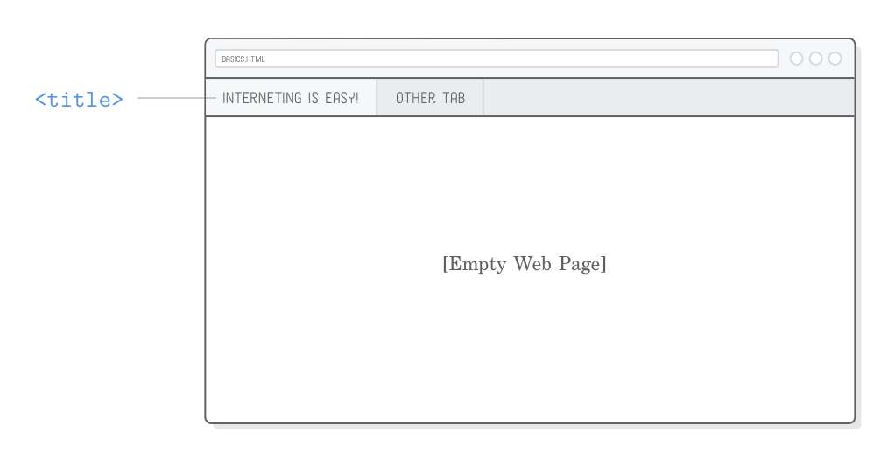
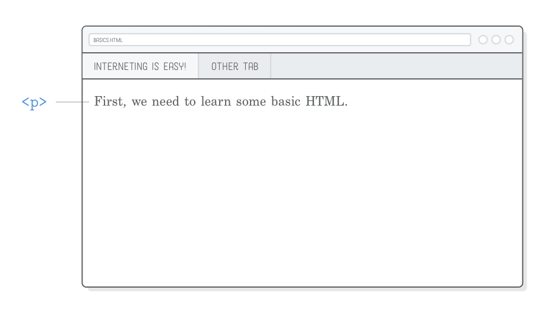
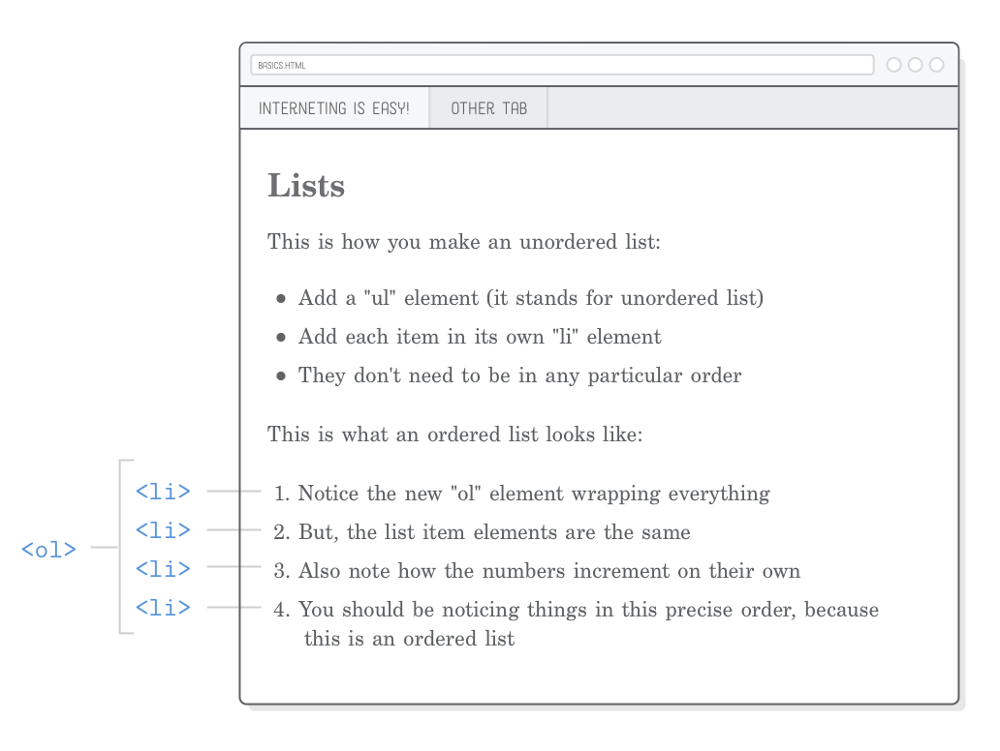
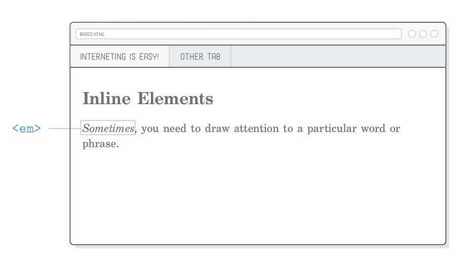

### 基本 web 页面

HTML定义了互联网上每个网页的内容。通过使用HTML标记“标记”原始内容，
您可以告诉Web浏览器如何显示您的内容的不同部分。创建带有正确标记内容的HTML文档是开发网页的第一步。


在本章中，我们将构建我们的第一个网页。它看起来像垃圾，
因为它不会有任何CSS附加到它，但它将作为一个HTML元素的完全介绍，Web开发人员每天工作。

当您通过示例的方式工作时，尝试将它们作为一个更实用的版本的所见即所得编辑器，如Google文档或Microsoft Word。我们将使用所有相同类型的内容（标题，段落，列表等），我们将使用HTML更明确地定义它们。

### 设置

让我们开始创建一个名为basic-web-pages的新项目。然后，在该文件夹中创建一个名为basics.html的新文件。
这个HTML文件代表一个网页，它是我们将本章所有代码放在哪里。如果您尚未设置Atom，请务必阅读本教程系列的简介。


### 网页的结构

将以下HTML标记添加到我们的basics.html文件。这是你将开始与你将生产的每一个网页。
通常，您将使用某种模板引擎避免重复键入冗余部分，但在本教程中，我们将专注于原始HTML。

```html
<!DOCTYPE html>
<html>
  <head>
    <!-- Metadata goes here -->
  </head>
  <body>
    <!-- Content goes here -->
  </body>
</html>
```

首先，我们需要告诉浏览器这是一个带有<！DOCTYPE html>行的HTML5网页。这只是一个特殊的字符串，当浏览器尝试显示我们的网页时，它总是需要看起来像上面。

然后，我们的整个网页需要包装在<html>标签中。实际的<html>文本称为“开始标签”，
而</ html>称为“结束标签”。这些标签中的所有内容都被认为是<html>“元素”的一部分，
这是Web浏览器解析HTML标签时所需要的。


在<html>元素中，我们有两个元素叫做<head>和<body>。网页的头部包含其所有元数据，例如页面标题，任何CSS样式表以及呈现页面所需的其他内容，但不一定需要用户看到。我们的HTML标记的大部分将存在于<body>元素中，它代表页面的可见内容。注意，在网络浏览器中打开我们的页面不会显示任何内容，因为它有一个空的<body>。


在我们开始使用CSS之后，这个<head> / <body>拆分的目的将在几个章节中更清楚。

还要注意上面片段中的HTML注释语法。以<！ - 开头并以 - >结尾的任何内容都将被浏览器完全忽略。这对于记录您的代码和为自己做笔记是有用的。

### 页面标题

元数据的最重要的部分之一是您的网页的标题，由适当命名的<title>元素定义。浏览器会在您的网页的标签中显示此信息，Google会在搜索引擎结果中显示此信息

请尝试更新我们的basic.html文件的<head>，以匹配以下内容：

```html
<!DOCTYPE html>
<html>
  <head>
    <title>Interneting Is Easy!</title>
  </head>
  <body>
    <!-- Content goes here -->
  </body>
</html>
```

当您在浏览器中重新载入网页时，您应该仍会看到一个空白网页，但您也会看到Interneting Is Easy！在浏览器标签：



请注意我们网页中的所有HTML标记如何整齐嵌套。确保没有重叠的元素是非常重要的。例如，<title>元素应在<head>中，因此您永远不想在结束</ title>标记之前添加结束</ head>标记：

```html
<!-- (Don't ever do this) -->
<head>
  <title>Interneting Is Easy!</head>
</title>
```

### 段落
标题都很好，但是让我们做一些我们可以看到的东西。 <p>元素将其中的所有文本标记为不同的段落。尝试将以下<p>元素添加到我们的网页正文：
```html
<!DOCTYPE html>
<html>
  <head>
    <title>Interneting Is Easy!</title>
  </head>
  <body>
    <p>First, we need to learn some basic HTML.</p>
  </body>
</html>
```
您现在应该可以在页面上看到一些内容。再次，因为这是我们想要显示的内容，它需要进入<body>元素，而不是<head>。



还要注意<p>和<title>元素如何缩进两次，而<body>和<head>缩进一次。缩进这样的嵌套元素是一个重要的最佳实践，使您的HTML更容易阅读其他开发人员（或自己，如果你回来5个月从现在，想要改变一些东西）。

由您和您的开发团队决定是否要对缩进使用空格或制表符。您可以在文本编辑器中的Atom > Preferences > Editor下设置此首选项，然后向下滚动到“标签类型”设置。

### 标题

标题就像Title，但它们实际上显示在页面上。 HTML提供六个级别的标题，并且相应的元素是：&lt;h1&gt;，&lt;h2&gt;，&lt;h3&gt;，...，&lt;h6&gt;。数字越高，标题越不突出。

页面上的第一个标题通常应为&lt;h1&gt;，因此我们在现有的&lt;p&gt;元素上方插入一个。第一个&lt;h1&gt;元素匹配文档的&lt;title&gt;是非常普遍的，因为它在这里：

```html
<body>
  <h1>Interneting Is Easy!</h1>
  <p>First, we need to learn some basic HTML.</p>
</body>
```

默认情况下，浏览器在较小的字体中呈现不太重要的标题。例如，让我们包括一个二级标题，看看会发生什么：

```html
<!DOCTYPE html>
<html>
  <head>
    <title>Interneting Is Easy!</title>
  </head>
  <body>
    <h1>Interneting Is Easy!</h1>
    <p>First, we need to learn some basic HTML.</p>

    <h2>Headings</h2>
    <p>Headings define the outline of your site. There are six levels of
    headings.</p>
  </body>
</html>
```

网页看起来像这样：


标题是标记内容不同部分的主要方式。他们定义您的网页的轮廓，人类和搜索引擎看到它，这使得选择相关的标题对于高质量的网页必不可少。

### 无序列表

每当您使用HTML标记包围一段文字时，都会为该文本添加新的含义。在<ul>标记中包含内容会告诉浏览器，其中的内容应该呈现为“无序列表”。要表示该列表中的各个项目，请将它们包装在<li>标记中，如下所示：

```html
<h2>Lists</h2>

<p>This is how you make an unordered list:</p>

<ul>
  <li>Add a "ul" element (it stands for unordered list)</li>
  <li>Add each item in its own "li" element</li>
  <li>They don't need to be in any particular order</li>
</ul>
```

将此标记添加到<body>元素（现有内容下方）后，您应该会看到一个带有每个<li>元素的专用项目符号的项目符号列表


HTML规范定义了关于什么元素可以进入其他元素的严格规则。在这种情况下，<ul>元素应该只包含<li>元素，这意味着你不应该这样写：

```html
<!--不要这样写-->
<ul>
  <p>Add a "ul" element (it stands for unordered list)</p>
</ul>
```
相反，您应该用<li>标记包装该段：
```html
<ul>
  <li><p>Add a "ul" element (it stands for unordered list)</p></li>
</ul>
```

我们如何知道<ul>只接受<li>元素并且<li>允许嵌套段落？因为[Mozilla开发人员网络（MDN）](https://developer.mozilla.org/en-US/docs/Web/HTML/Element/ul)这么说。 MDN是一个精湛的HTML元素引用。在本教程中，我们将尝试尽可能多地介绍如何使用基本HTML元素，但如果您不确定某个元素，请查询“MDN”。

### 有序列表

对于无序列表，重新排列<li>元素不应更改列表的含义。如果列表项的顺序很重要，您应该使用“有序列表”。要创建有序列表，只需将父<ul>元素更改为<ol>。将以下内容附加到basics.html的“列表”部分：

```html
<p>This is what an ordered list looks like:</p>

<ol>
  <li>Notice the new "ol" element wrapping everything</li>
  <li>But, the list item elements are the same</li>
  <li>Also note how the numbers increment on their own</li>
  <li>You should be noticing things is this precise order, because this is
      an ordered list</li>
</ol>
```

当您在浏览器中重新载入网页时，您会发现浏览器会自动为每个<li>元素增加计数。在[认识 CSS]()中，我们将学习如何更改显示哪种类型的数字。



无序列表和有序列表之间的区别似乎很蠢，但它确实对Web浏览器，搜索引擎，当然，人类读者有重要意义。这也比手动编号每个列表项更容易。

一步步步的过程，如食谱，指令，甚至内容表是有序列表的好候选，而<ul>列表更适合表示项目库存，产品特性，专业/普通比较和导航菜单。

### 重点（斜体）元素
到目前为止，我们只使用“块级元素”（也称为“流内容”）。内容的另一个主要类型是“内联元素”或“短语内容”，它们有点不同。块级元素始终绘制在一个新行上，而行内元素可以影响一行内任何位置的文本部分。


例如，<p>是块级元素，而<em>是影响段落内部文本跨度的内联元素。它代表“重点”，它通常显示为斜体文本。尝试在示例网页中添加一个演示强调文本的部分：

```html
<h2>Inline Elements</h2>

<p><em>Sometimes</em>, you need to draw attention to a particular word or
phrase.</p>
```

包含在<em>标签中的部分应以斜体显示，如下所示。注意线的一部分是如何受到影响的，这是内联元素的特征。在[CSS盒子模型]一章中，我们将了解内联和块元素如何对页面布局产生巨大影响。



为了防止它还没有沉没，真正重要的是你正确嵌套你的HTML元素。当您使用多个内联元素时，更容易混淆标记的顺序，因此请务必仔细检查您的标记是否如下所示：

```html
<!-- (Again, don't ever do this) -->
<p>This is some <em>emphasized text</p></em>
```

### strong (bold) 元素

如果您想要比<em>标签更强调，您可以使用<strong>。它是一个内联元素，就像<em>，看起来像这样：

```html
<p>Other times you need to <strong>strong</strong>ly emphasize the importance
of a word or phrase.</p>
```

它应该以粗体文本呈现，如下所示：


为了更多地关注你的一段文本，你可以在<em>元素中嵌入<strong>元素（反之亦然）。这将给你强烈和强调的文本：

```html
<p><em><strong>And sometimes you need to shout!</strong></em></p>
```

正如文本所示，这实际上是排版的等同排版。有一个阅读通过[Web排版]()一章前变得太疯狂与粗体和斜体字体。


### 结构与呈现

你可能会想知道为什么我们使用“strong”和“emphasis”而不是“italic”和“粗bold”。这使我们在HTML和CSS之间有一个重要的区别。 HTML标记应该提供关于您的语义信息 内容 - 不呈现信息。换句话说，HTML应该定义文档的结构，将其外观留给CSS。


过时的<b>和<i>元素是这种情况的典型示例。他们曾经分别代表“bold”和“italic”，但HTML5试图在文档的结构和其表示之间创建明确的分离。因此，用<em>替换<i>，因为除了斜体（例如，以不同的字体，不同的颜色或更大的尺寸）之外，可以以各种方式显示加强的文本。与<b>和<strong>相同。

我们将在[Hello，CSS]()中发现，我们可以改变浏览器的<strong>和<em>元素的默认渲染。这进一步说明了我们不应该将它称为HTML中的斜体或粗体文本，这是CSS的一个决定。

### 空的HTML元素

到目前为止，我们遇到的HTML标签要么封装文本内容（例如，<p>）或其他HTML元素（例如，<ol>）。这不是所有HTML元素的情况。其中一些可以是“空”或“自闭”。换行符和水平线是最常见的空元素。

#### 换行符

HTML将连续的空格，制表符或换行符（统称为“空格”）缩进一个空格。要查看我们正在谈论的内容，请将以下部分添加到我们的basics.html文件中：

```html
<h2>Empty Elements</h2>

<p>Thanks for reading! Interneting should be getting easier now.</p>

<p>Regards,
The Authors</p>
```

在上面的代码段中的Regards之后的换行符将被转换为空格，而不是显示为换行符


这种行为可能看起来很直观，但Web开发人员通常设置其文本编辑器将行长限制为大约80个字符。作为一个程序员，这种方式更容易管理代码，但是每个新行显示在呈现的页面将严重混乱想要的页面布局。

要告诉浏览器我们想要一个换行，我们需要使用一个明确的&lt;br/&gt;元素，如下所示：

```html
<p>Regards,<br/>
The Authors</p>
```

除了文字格式外， Haiku，音乐歌词和签名只是几个例子，它可能会派上用场。


但是，要非常小心，不要滥用&lt;br/&gt;标签。你使用的每一个都应该传达意义 - 你不应该使用它，说，在段落之间添加一堆空间：

```html
<!-- (不要这样做) -->
<p>This paragraph needs some space below it...</p>
<br/><br/><br/><br/><br/><br/><br/><br/>
<p>So, I added some hard line breaks.</p>
```
如上一节所讨论的，这种表现信息应该在你的CSS而不是你的HTML中定义。

### 水平规则

&lt;hr/&gt;元素是一个“水平规则”，表示专题断点。从一个故事的一个场景到下一个场景或在一个字母和一个后记之间的过渡是当水平规则可能是合适的时候的好例子。例如：

```html
<h2>Empty Elements</h2>

<p>Thanks for reading! Interneting should be getting easier now.</p>

<p>Regards,<br/>
The Authors</p>

<hr/>

<p>P.S. This page might look like crap, but we'll fix that with some CSS
soon.</p>
```

本章的主题之一是内容（HTML）与演示文稿（CSS）的分离，而&lt;hr /&gt;没有什么不同。像&lt;em&gt;和&lt;strong&gt;，它有一个默认的外观（水平线），但一旦我们开始使用CSS，我们将能够渲染它作为更多的空间之间的部分，装饰口音字符，我们想要的任何东西。


&lt;hr /&gt;,&lt;br/&gt;应该携带的意义，当你只是为了美观显示一行不要使用它们。为此，您将需要使用CSS border属性，我们将在几个章节中讨论。

考虑&lt;hr /&gt;元素的另一种方法是，它比由新标题创建的分隔不太重要 元素，但比新的段落更有意义。

### 可选的尾部斜杠

所有空HTML元素中的尾部斜杠（/）是完全可选的。以上代码段也可以这样标记（注意/在&lt;br&gt;和&lt;hr&gt;标签中缺少）：
```html
<p>Regards,<br>
The Authors</p>

<hr>
```

加与不加没有绝对正确，但一定要保持一致性。在本教程中，我们将包含尾随/字符，因为它清楚地表明它是一个自我关闭的元素。这将有助于防止您的眼睛在文档中的其他位置搜索结束标记。

### 总结

本章可能看起来像一个无休止的HTML元素列表，而且，它基本上是。 HTML很简单，直到它。网页由HTML元素组成，每个元素为其包含的文本添加不同的含义，元素可以嵌套在彼此之内。

我们在本章中做的是始终是Web开发过程的第一步 - 你需要在定义你想说什么（CSS）之前定义你想说什么（HTML）。希望我们在本章中创建的basics.html文件可以作为核心HTML元素的有用的快速参考。如果你偶然发生错误，它应该是什么样子：


我们讨论了如何编写HTML就像在所见即所得文档编辑器中操作内容一样。 HTML显然是一个更加手动的过程，但是权衡是它令人难以置信的灵活性。您可以将其显示在网页，移动设备，平板电脑或打印的纸张上，每个都有不同的布局。您甚至可以通过更改单行CSS重新设置多个文档的样式。 Microsoft Word没有接近HTML和CSS作为内容媒介的潜力。

在下一章中，我们将使用您每天将遇到的其他元素来完成HTML教育：链接和图像。对于更模糊的元素，我们将让您自己浏览MDN的[HTML元素引用](https://developer.mozilla.org/en-US/docs/Web/HTML/Element)。
