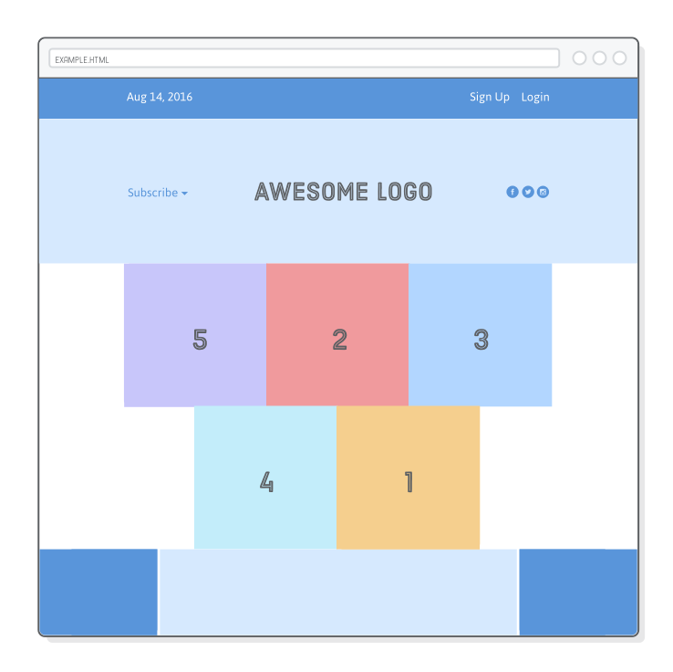
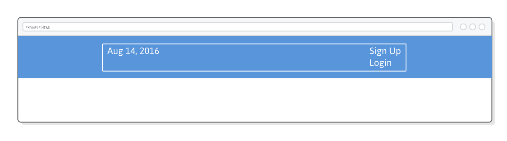
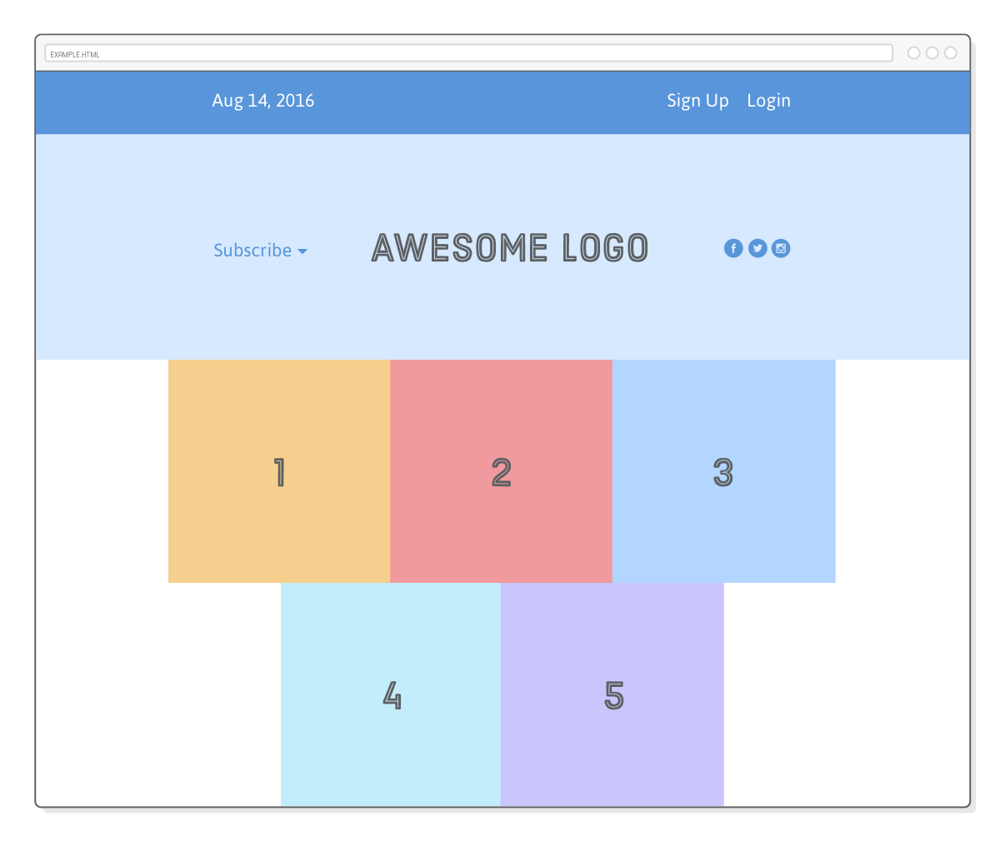
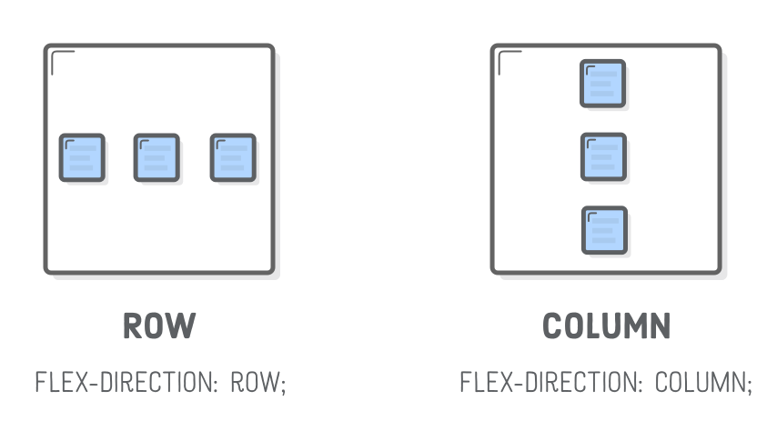
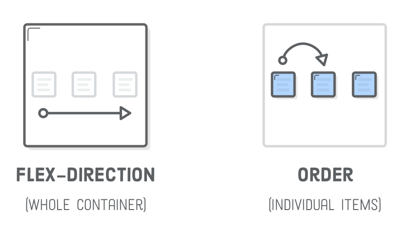
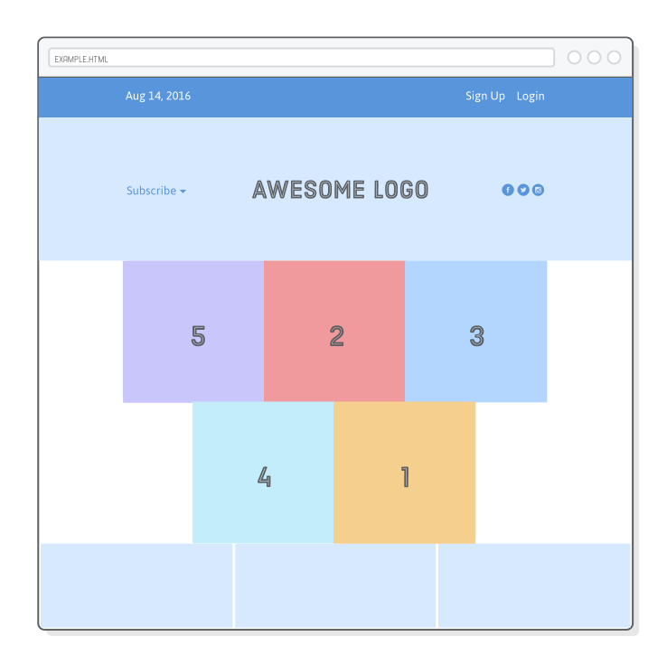

## Flexbox

友好的现代CSS布局

“Flexible Box”或“Flexbox”布局模式为Floats提供了一种整体外观的网页的替代方案。
而 floats 只能让我们水平放置我们的盒子，flexbox可以完全控制我们的盒子的对齐方向，顺序和尺寸。


Web 正在经历重大转型，所以有必要对行业状况进行一些讨论。在过去的十年里，floats 是搭建复杂网页的
唯一选择。因此，即使在传统浏览器中，它们仍然得到很好的支持，开发人员已经使用它们来开发数百万个网页。
这意味着在你的职业生涯里你讲不可避免的遇到 floats（因此上一章的知识并不过时）。

然而，floats 是针对我们在浮动内容中所涵盖的杂志风格的布局而设定的，尽管我们看到最后一章，你可以使用
floats 创建的布局种类很有限，即使是一个简单的边栏布局，也需要一点点 hack（打破常规），Flexbox被发明以突破这些限制。

我们终于等到了浏览器支持开发人员可以使用flexbox构建完整的网站的时刻。我们的建议是使用flexbox来尽可能地布置网页，
当你需要文本浮动（即杂志风格的布局）或需要支持旧版网络浏览器时，使用 floats。


在本章，我们将逐步探索整个Flexbox布局模型。您应该摆脱任何网页设计师可以给你的布局。

------

### 设置

本章的例子相对简单，但它清楚地显示了所有重要的flexbox属性。我们将会作出这样的的布局：



对于初学者，我们需要一个空的HTML文档，其中只包含一个菜单栏。制作一个名为flexbox的新Atom项目，
以容纳本章的所有示例文件。然后，创建flexbox.html并添加以下标记：

```html
<!DOCTYPE html>
<html lang='en'>
  <head>
    <meta charset='UTF-8'/>
    <title>Some Web Page</title>
    <link rel='stylesheet' href='styles.css'/>
  </head>
  <body>
    <div class='menu-container'>
      <div class='menu'>
        <div class='date'>Aug 14, 2016</div>
        <div class='signup'>Sign Up</div>
        <div class='login'>Login</div>
      </div>
    </div>
  </body>
</html>
```

接下来我们创建相应的 styles.css 样式表，这样看起来不会很像：只有全宽蓝色的菜单栏中有一个白边框。
注意，我们将使用flexbox而不是传统的自动边距技术将菜单居中。

```css
* {
  margin: 0;
  padding: 0;
  box-sizing: border-box;
}

.menu-container {
  color: #fff;
  background-color: #5995DA;  /* 蓝色 */
  padding: 20px 0;
}

.menu {
  border: 1px solid #fff;  /* 为了演示 */
  width: 900px;
}
```

最后，[下载一些图片]()供我们的示例网页使用。将它们解压缩到flexbox项目中，保留父图像目录。
在开始之前，您的项目应该是这样的：


### Flexbox 概述
 
Flexbox使用了我们从未见过的两种类型的盒子：“flex container”和“flex items”。
Flex container 的工作是将一堆 Flex item 组合在一起，并定义它们的位置。


Flex容器的每个HTML元素都是一个“item”。 Flex item可以单独操作，
但在大多数情况下，由容器决定其布局。Flex item 的主要目的是让他们的容器知道需要定位多少件事情。

与基于浮动的布局一样，使用flexbox定义复杂网页都是关于嵌套框。将一堆Flex item对齐在一个容器中，
反过来，这些项目可以作为自己的项目的flex容器。当您完成本章中的示例时，请记住，
布局页面的基本任务没有改变：我们仍然只是移动一堆嵌套框。

### flex containers（flex 容器）

使用flexbox的第一步是将我们的一个HTML元素转换为一个Flex容器。我们使用display属性来实现，
该属性应该从CSS Box Model一章中讲过。通过给它一个flex的值，我们告诉浏览器，
框中的所有内容都应该用flexbox而不是默认框模型来呈现。

将下行添加到我们的.menu-container 规则中，将其转换为一个flex容器：

```css
.menu-container {
  display: flex;
}
```

这使得Flexbox布局模式 - 没有它，浏览器将忽略我们即将要介绍的所有flexbox属性。
明确定义Flex容器意味着您可以将Flexbox与其他布局模型（例如，浮动和我们要在[高级定位]()中学习的所有内容）
进行混合和匹配。


太棒了！现在我们有一个flex容器，里面有一个flex项目。但是，我们的页面看起来与之前完全一样，
因为我们没有告诉容器如何显示它的项目

### 对齐一个flex item

你有一个flex容器后，你的下一个工作就是定义它的项目的水平对齐。就是justify-content属性。
我们可以用它来居中我们的菜单，就像这样：

```css
.menu-container {
  display: flex;
  justify-content: center;    /* 添加这行 */
}
```

这具有与.menu元素添加margin：0自动声明相同的效果。但是，请注意，我们如何通过向父元素（flex容器）添加属性，
而不是直接添加到我们想要中心的元素（flex项）中。通过这样的容器操作物品是flexbox中的一个常见主题，
与我们迄今为止定位盒子有点分歧。


justify-content 属性可以使用的值有：

 * center
 * flex-start
 * flex-end
 * space-around
 * space-between
 
尝试将justify-content更改为flex-start和flex-end。这应该将菜单分别与浏览器窗口的左侧和右侧对齐。
确保将其更改为中心，然后再继续。最后两个选项仅在容器中有多个Flex项目时有用。

分布多个flex item

你可能会说：我们可以用 floats 做左/右对齐，使用 auto-margins 居中。是的，在容器中有多个项目之前，
Flexbox不会显示出真正的实力。 justify-content属性还允许您在容器内平均分配项目。


更改 .menu 规则如下：

```css
.menu {
  border: 1px solid #fff;
  width: 900px;
  display: flex;
  justify-content: space-around;
}
```

这将我们的.menu转换为一个嵌套的flex容器，并且空格值将其项目扩展到整个宽度。你应该看到这样的东西：


Flex容器自动向每个项目的任一侧分配额外的水平空间。值之间的值是相似的，但它只增加了项之间的额外空间。
这是我们实际需要的示例页面，所以继续更新对齐内容行：

```css
justify-content: space-between;
```

当然你如果想把所有项目放置一侧可以使用 center, flex-start, flex-end

### 分组 flex item

Flex容器只知道如何定位一级深度的元素（即它们的子元素）。他们不在乎一些关于他们的flex项目的内容。
这意味着将flex项目分组是您的布局创建库中的另一个武器。在一个额外的<div>中包裹一堆项目会导致完全不同的网页。


例如，假设您要同时注册和登录链接位于页面的右侧，如下面的屏幕截图所示。
所有我们需要做的是将它们粘在另一个<div>中：

```html
<div class='menu'>
  <div class='date'>Aug 14, 2016</div>
  <div class='links'>
    <div class='signup'>Sign Up</div>      <!-- This is nested now -->
    <div class='login'>Login</div>         <!-- This one too! -->
  </div>
</div>
```

而不是有三个项目，我们的.menu flex容器现在只有两个（.date和.links）。
在现有的space-between之间，它们会捕捉到页面的左侧和右侧。



但是，现在我们需要布局.links元素，因为它使用默认块布局模式。解决方案：更多嵌套的Flex容器！
在我们的styles.css文件中添加一个新规则，将.links元素转换为一个flex容器

```css
.links {
  border: 1px solid #fff;  /* 为了演示 */
  display: flex;
  justify-content: flex-end;
}

.login {
  margin-left: 20px;
}
```

这将把我们的链接放在我们想要的地方。请注意，margin 仍然像CSS Box Model一样工作。
而且与正常的盒子模型一样，自动边距在flexbox中有一个特殊的含义（我们将在本章结尾解释）。


我们不再需要这些白色边框了，所以如果你愿意，你可以继续删除它们。

### 横轴（垂直）对齐

目前为止，我们一直在操纵水平对齐，但是Flex容器也可以定义它们的项目的垂直对齐方式。floats 
很难做到这点.


为了探索这个问题，我们需要在菜单下添加一个标题。在.menu-container元素之后，将以下标记添加到flexbox.html：

```html
<div class='header-container'>
  <div class='header'>
    <div class='subscribe'>Subscribe &#9662;</div>
    <div class='logo'></div>
    <div class='social'></div>
  </div>
</div>
```

接下来，添加一些基本样式，使其与.menu元素对齐：

```css
.header-container {
  color: #5995DA;
  background-color: #D6E9FE;
  display: flex;
  justify-content: center;
}

.header {
  width: 900px;
  height: 300px;
  display: flex;
  justify-content: space-between;
}
```

这一切都应该是熟悉的，但是这种情况与我们的菜单有点不同。由于.header具有明确的高度，
所以物品可以垂直放置在其中。官方规范称之为“跨轴”对齐（我们将在稍后看到为什么），
但为了我们的目的，它也可以被称为“垂直”对齐。


通过向flex容器添加align-items属性来定义垂直对齐。让我们的示例页面与上面的屏幕截图匹配以下行：

```css
.header {
  align-items: center;  /* Add this */
}
```

对齐项目的可用选项与justify-content类似：

 * center
 * flex-start (top)
 * flex-end (bottom)
 * stretch
 * baseline
 


大多数这些都很简单。拉伸选项值得花一点时间玩，因为它可以显示每个元素的背景。
让我们简单的看一下，将以下内容添加到styles.css中：

```css
.header {
  /* ... */
  align-items: stretch;    /* Change this */
}

.social,
.logo,
.subscribe {
  border: 1px solid #5995DA;
}
```

每个项目的框扩展了Flex容器的全部高度，无论其包含多少内容。这
种行为的常见用例是创建具有每个变量的内容的等高列，这与浮点非常困难。

确保删除上述更改，并将我们的内容在.header内垂直放置，然后再继续。

### 包裹 flex items

Flexbox是基于浮动网格的更强大的替代方案。它不仅可以将项目呈现为网格，还可以改变其对齐方向，顺序和大小。
要创建一个网格，我们需要flex-wrap属性。


将一行照片添加到flexbox.html，以便我们可以使用。这应该在<body>之下，在.header-container元素下面：

```html
<div class='photo-grid-container'>
  <div class='photo-grid'>
    <div class='photo-grid-item first-item'>
      
    </div>
    <div class='photo-grid-item'>
      
    </div>
    <div class='photo-grid-item'>
      
    </div>
  </div>
</div>
```

再次，相应的CSS应该从前面的部分熟悉：

```css
.photo-grid-container {
  display: flex;
  justify-content: center;
}

.photo-grid {
  width: 900px;
  display: flex;
  justify-content: flex-start;
}

.photo-grid-item {
  border: 1px solid #fff;
  width: 300px;
  height: 300px;
}
```

这应该与预期的一样，但要注意当我们添加更多的项目而不是适合Flex容器时会发生什么。
在.photo-grid中插入额外的两张照片：

```html
<div class='photo-grid-item'>
  
</div>
<div class='photo-grid-item last-item'>
  
</div>
```

默认情况下，它们从页面的边缘溢出：


如果您正在尝试构建一个英雄横幅，让用户可以横向滚动一堆照片，这可能是所期望的行为，
但这不是我们想要的。添加以下flex-wrap属性强制不符合以下条件的项目：

```css
.photo-grid {
  /* ... */
  flex-wrap: wrap;
}
```

现在，我们的flex项目的行为非常像浮动框，除了flexbox可以更好地控制通过justify-content属性
在最后一行中如何对“额外”项进行对齐。例如，最后一行当前是左对齐的。通过更新我们的.photo-grid规则来尝试中心，
像这样：

```css
.photo-grid {
  width: 900px;
  display: flex;
  justify-content: center;    /* Change this */
  flex-wrap: wrap;
}
```

以浮动布局实现这一点是非常复杂的。



### Flex container 方向

“方向”是指容器是水平还是垂直地呈现物品。到目前为止，我们看到的所有容器都使用默认的水平方向，
这意味着项目在同一行中逐个绘制，然后在空格不足之前弹出下一列。



关于flexbox最令人惊奇的事情之一就是它只能使用一行CSS来将行转换成列。尝试将以下flex-direction声明添加到我们的.photo-grid规则中：

```css
.photo-grid {
  /* ... */
  flex-direction: column;
}
```

这将从默认行值更改容器的方向。而不是网格，我们的页面现在有一个垂直列：


响应式设计的关键客户向移动和桌面用户呈现相同的HTML标记。这提出了一个问题，因为大多数移动布局是单列，
而大多数桌面布局水平堆叠元素。您可以想象，一旦我们开始构建响应式布局，Flex方向将会有多么有用。

#### 对齐考虑

请注意，尽管我们的内容是正确的，但是该列仍然拥抱其Flex容器的左侧：center;声明。旋转容器的方向时，
还可以旋转justify-content属性的方向。它现在是指容器的垂直对齐方式，而不是其水平对齐方式。


要使我们的列水平居中，我们需要在.photo-grid上定义一个align-items属性：

```css
.photo-grid {
  /* ... */
  flex-direction: column;
  align-items: center;      /* Add this */
}
```

### flex 容器顺序

到目前为止，我们的HTML元素的顺序和框架在网页中呈现的方式之间存在紧密的相关性。
使用float或我们迄今为止看到的flexbox技术，我们可以使框之前或之后出现的唯一方法就是移动底层的HTML标记。
接下来将发生改变。


flex-direction属性还可以通过行反向和列反向属性来控制项目显示的顺序。为了看到这一点，
让我们将我们的列转换成一个网格，但是这一次我们会扭转一切的顺序：

```css
.photo-grid {
  width: 900px;
  display: flex;
  justify-content: center;
  flex-wrap: wrap;
  flex-direction: row-reverse;  /* <--- Really freaking cool! */
  align-items: center;
}
```

这两行现在从右到左而不是从左到右。但是，请注意，这只是以每行为单位交换顺序：
第一行不是从5开始，它从3开始。这对于许多常见的设计模式是有用的（列反向特别打开很多门的移动布局）。
我们将在下一节中学习如何获得更多细节。


从样式表中重新排序元素是一件很大的事情。在flexbox之前，Web开发人员不得不诉诸JavaScript的hack来完成这样的事情。
但是，不要滥用你新发现的能力。正如我们在本教程第一章中讨论的，您应该始终将内容与演示文稿分开。
改变这样的顺序是纯粹的表现形式 - 如果没有应用这些样式，你的HTML仍然有意义

### flex item 顺序

整个章节一直是通过其父容器定位flex项目，但也可以操作单个项目。
本章的其余部分将把焦点从Flex容器转移到它们所包含的项目上。



向flex项目添加订单属性可以在容器中定义其顺序，而不影响周围的项目。它的默认值为0，
并从中增加或减少它将分别向左或向右移动项目。

例如，这可以用于交换我们网格中的.first-item和.last-item元素的顺序。
我们还应该将上一节中的行反转值更改回行，因为它会使我们的编辑更容易看到：

```css
.photo-grid {
  /* ... */
  flex-direction: row;  /* Update this */
  align-items: center;
}

.first-item {
  order: 1;
}

.last-item {
  order: -1;
}
```

在Flex容器上设置row-reverse和column-reverse不同，顺序在行/列边界之间工作。
上述代码段将切换我们的第一个和最后一个项目，即使它们出现在不同的行。

### flex item 对齐

我们可以做同样的事情与垂直对齐。如果我们希望“订阅”链接和这些社交图标位于标题底部而不是中心，
该怎么办？单独对齐这是align-self属性的地方。将它添加到flex项目将覆盖其容器中的align-items值：

```css
.social,
.subscribe {
  align-self: flex-end;
  margin-bottom: 20px;
}
```

这应该将它们发送到.header的底部。请注意，边距（padding）也可以像您预料的那样工作。


您可以使用与对齐项目属性相同的值以其他方式对齐元素，以便方便下面列出。

 * center
 * flex-start
 * flex-bottom
 * stretch
 * baseline
 
### flex items

我们所有的例子都围绕固定或内容定义宽度的项目。这让我们专注于flexbox的定位方面，
但这也意味着我们一直忽视其同名的“灵活盒”性质。 Flex物品是灵活的：它们可以收缩和拉伸以匹配其容器的宽度。

flex属性定义了Flex容器中各个项目的宽度。或者，更准确地说，它允许它们具有灵活的宽度。
它作为一个权重，告诉Flex容器如何分配额外的空间到每个项目。例如，
flex值为2的项目的增长速度将是默认值为1的项目的两倍。


首先，我们需要一个页脚进行实验。贴在.photo-grid-container元素后面：

```html
<div class='footer'>
  <div class='footer-item footer-one'></div>
  <div class='footer-item footer-two'></div>
  <div class='footer-item footer-three'></div>
</div>
```

```css
.footer {
  display: flex;
  justify-content: space-between;
}

.footer-item {
  border: 1px solid #fff;
  background-color: #D6E9FE;
  height: 200px;
  flex: 1;
}
```

flex：1;行告诉项目伸展以匹配.footer的宽度。因为他们都拥有相同的重量，他们会平均地伸展：



增加其中一个项目的重量使其增长速度比其他项目快。例如，我们可以使第三个项目的增长速度是其他两个项目的两倍，
具有以下规则：

```css
.footer-three {
  flex: 2;
}
```

将此与对齐内容属性进行比较，该属性在项目之间分配额外的空间。这是类似的，但现在我们将这个空间分配到项目本身。
结果是完全控制弹性件如何装入其容器。

#### 静态item宽度

我们甚至可以使用固定宽度的盒子混合搭配灵活的盒子。 flex：初始化返回到项的显式宽度属性。
这使我们能够以复杂的方式结合静态和灵活的框。


我们将使我们的脚注与上图相似。中心项目是灵活的，但任何一方的大小总是相同的。我们需要做的是将以下规则添加到我们的样式表中：

```css
.footer-one,
.footer-three {
  background-color: #5995DA;
  flex: initial;
  width: 300px;
}
```

没有flex：initial;线，flex：1;声明将从.footer-item规则继承，导致宽度属性被忽略。
初始修复这个，我们得到一个灵活的布局，也包含固定宽度的项目。当您调整浏览器窗口大小时，
您将看到只有页脚中的中间框被调整大小。


这是一个很常见的布局，而不仅仅是页脚。例如，许多网站都有一个固定宽度的侧边栏（或多个边栏）
和一个包含页面主文本的灵活的内容块。这基本上是我们刚刚创建的页脚的一个更高的版本。

### 弹性项目和自动边距

flexbox中的自动边距是特殊的。当尝试将一组项目与容器的左/右对齐时，
它们可以用作额外的<div>的替代方法。将自动边距视为同一容器中的弹性项目的“分隔符”。

让我们来看看我们在.menu中的项目，使它符合以下条件：

```html
<div class='menu-container'>
  <div class='menu'>
    <div class='date'>Aug 14, 2016</div>
    <div class='signup'>Sign Up</div>
    <div class='login'>Login</div>
  </div>
</div>
```

重新加载页面应该可以通过我们的菜单平均分配，就像本章开头一样。我们可以通过在我们想要分离的
项目之间粘贴自动边距来复制所需的布局，如下所示：

```css
.signup {
  margin-left: auto;
}
```

自动边距会占用Flex容器中的所有额外空间，因此不会将.signup和任何以下项（.login）移动到容器的右侧。
这将给你完全相同的布局，但没有额外的嵌套的<div>来分组。有时候，保持你的HTML更友好。

### 总结

Flexbox为我们提供了许多令人惊奇的新工具来布局网页。将这些技术与我们能够使用float进行比较，
应该很清楚，flexbox是布局现代网站的更简洁选项：

* 使用 display: flex; 来创建flex容器
* 使用 justify-content 来定义项目的水平对齐
* 使用 align-items 来定义项目的垂直对齐
* 使用 flex-direction 将行转换成列
* 使用 row-reverse、column-reverse来翻转项目顺序
* 使用 order 自定义单个元素的顺序。 
* 使用 align-self 垂直对齐各个项目
* 使用 flex 创建可以拉伸和收缩的弹性框。

请记住，这些flexbox属性只是一种语言，可让您告知浏览器如何排列一堆HTML元素。
困难的部分并不是实际编写HTML和CSS代码，它在概念上（在一张纸上），所有必要的框架的行为来创建给定的布局。

当设计人员为您实现模型实现时，您的第一个任务是在其上绘制一堆框，并确定它们应如何堆叠，拉伸和缩小以实现所需的设计。
一旦完成了，使用这些新的flexbox技术就可以很容易地进行编码。

Flexbox布局模式应该用于大部分的网页，但是有些事情并不是那么好，比如轻轻调整元素位置，
并阻止它们与页面的其余部分进行交互。在下一章中介绍了这些先进的定位技术后，您将成为一名HTML和CSS定位专家。


