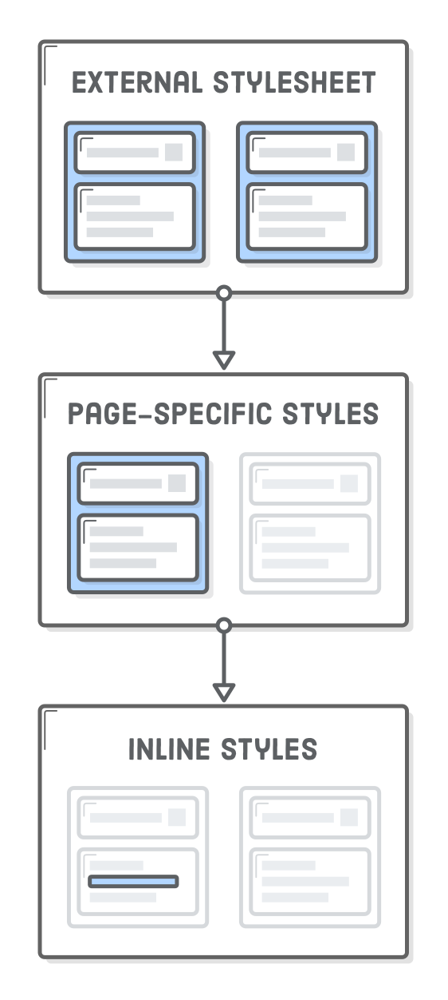
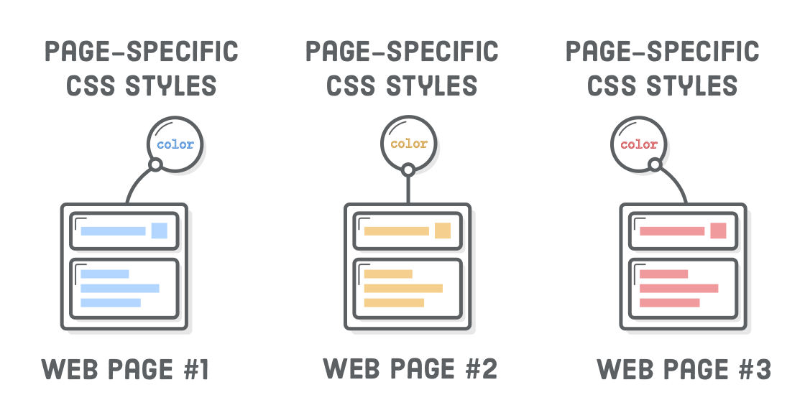
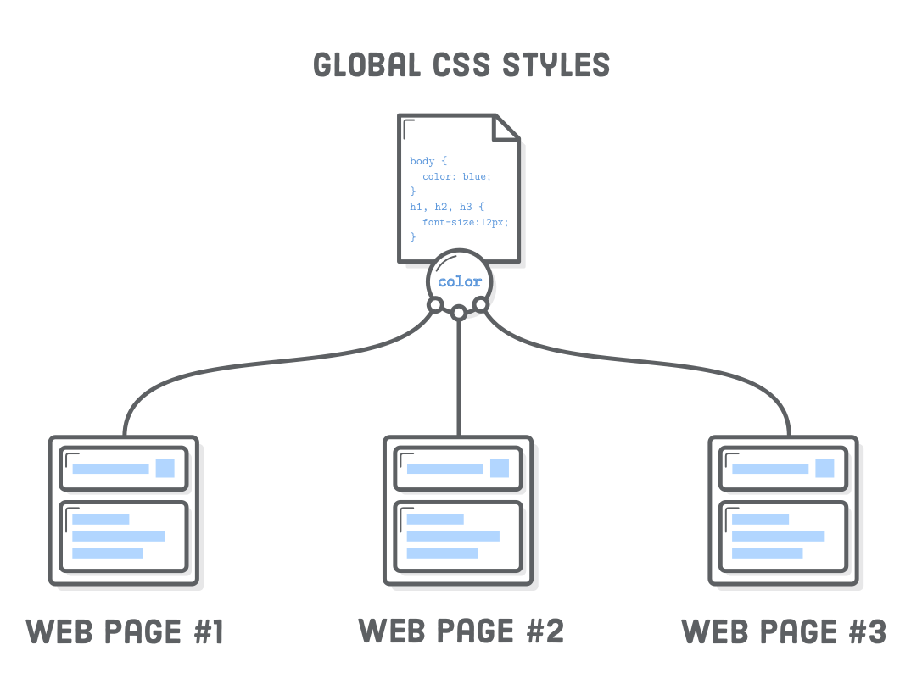
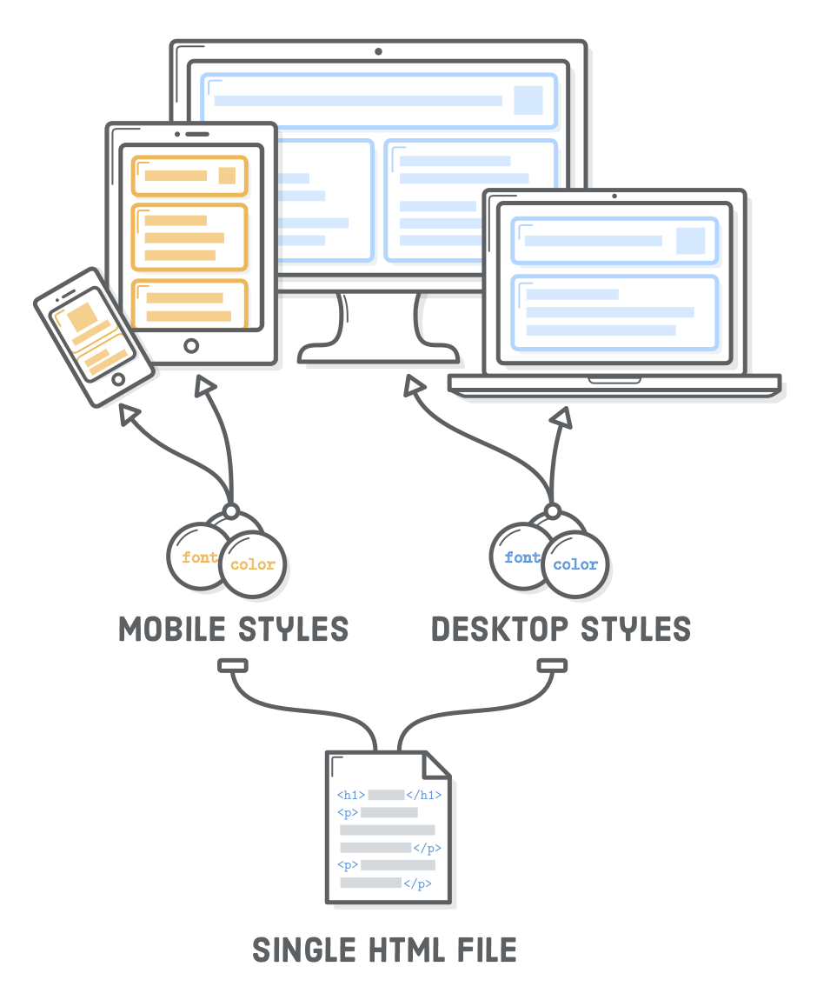

## 你好，css

本教程的前几章专注于HTML。现在是时候接触层叠样式表（CSS）了。
你可以认为CSS是作为定义网页的“设计”。它决定利用HTML完全独立的语言，如字体大小，边距和颜色的东西。

它是一个单独的语言吗？它存在完全不同的目的。代表HTML网页的内容，
而CSS定义内容是如何呈现给用户。这是一个根本性的区别中央对现代网络的发展。


CSS提供的词汇来告诉喜欢，Web浏览器的东西：“我希望我的标题是非常大的，我的侧边栏显示在主文章的左边。”
HTML没有的术语，使这些类型的布局decisions-所有能说的是，“这是一个标题，这是一个侧边栏。”

在本章中，我们将探讨CSS的基本语法，以及如何将其连接到我们的HTML文档。我们的目标是不是要成为一个CSS专家或记住所有可用的样式，
而是要了解CSS和HTML互动。CSS通常生活在自己的文件，以便在前面的章节中，良好的文件组织将是至关重要的。

### 设置

为了简单起见，我们将存储在一个单独的文件夹本教程的每一章的例子。使用的Atom，创建一个名为新项目hello-css。我们将被称为造型现有页面hello-css.html，所以继续前进，创建，然后添加下面的标记：

```html
<!DOCTYPE html>
<html lang='en'>
  <head>
    <meta charset='UTF-8'/>
    <title>Hello, CSS</title>
  </head>
  <body>
    <h1>Hello, CSS</h1>

    <p>CSS lets us style HTML elements. There’s also
       <a href='dummy.html'>another page</a> associated with this example.</p>

    <h2>List Styles</h2>

    <p>You can style unordered lists with the following bullets:</p>

    <ul>
      <li>disc</li>
      <li>circle</li>
      <li>square</li>
    </ul>

    <p>And you can number ordered lists with the following:</p>

    <ol>
      <li>decimal</li>
      <li>lower-roman</li>
      <li>upper-roman</li>
      <li>lower-alpha</li>
      <li>upper-alpha</li>
      <li>(and many more!)</li>
    </ol>
  </body>
</html>
```
此外，我们还需要一个小的虚拟页面，了解CSS样式如何应用到多个网页。创建dummy.html并添加以下内容：

```html
<!DOCTYPE html>
<html lang='en'>
  <head>
    <meta charset='UTF-8'/>
    <title>Dummy</title>
  </head>
  <body>
    <h1>Dummy</h1>

    <p>This is a dummy page that helps us demonstrate reusable CSS
       stylesheets. <a href='hello-css.html'>Go back</a>.</p>

    <p>Want to try crossing out an <a href='nowhere.html'>obsolete link</a>? This
       is your chance!</p>
  </body>
</html>
```

### css样式表

CSS样式表驻留在同一个明文文件.css 扩展名。创建一个名为新文件，styles.css我们在 hello-css文件夹中。这将房子本章我们所有的例子片段。让我们添加一个CSS规则，这样我们可以告诉如果我们的样式表迷上了我们的HTML页面正常。

```css
body {
  color: #FF0000;
}
```

一个CSS“规定”总是以“选择”定义它适用于任何HTML元素开始。在这种情况下，我们试图将样式 <body>元素。选择后，我们有“声明块”一些大括号内。任何“属性”设置，我们这里会影响<body>元素。


color是通过确定已经选择的任何HTML元素的文本颜色CSS规范中定义的内置属性。它接受代表的颜色的十六进制值。 #FF0000指鲜红色。

CSS属性是一种像HTML属性，它们都处理键-值对。除非，在这里我们定义 表象的信息，而不是促进了 语义相关内容的意义。

### 链接css样式表

如果您尝试加载无论是在浏览器的HTML页面，你不会看到我们在行动样式表。这是因为我们没有在一起尚未联系起来。这是HTML什么<link/>元素是。在hello-css.html，更改<head>为以下内容：


```html
<head>
  <meta charset='UTF-8'/>
  <title>Hello, CSS</title>
  <link rel='stylesheet' href='styles.css'/>
</head>
```

这个<link/>元素是浏览器如何知道自己需要加载styles.css当他们试图使我们的 hello-css.html页面。现在，我们应该看到刺眼的红色文字随处可见：


的<link/>元件是一样的 <a>元件，但它只是意味着的内使用 <head>。因为它是在文档的头， <link/>连接到元数据这就是当前文档外定义。另请注意，这是一个空元素，所以它不需要关闭标签。

该rel属性定义了资源和HTML文件之间的关系。到目前为止，最常用的值是stylesheet，但也有一些其他选项。该href属性的工作一样，在前面的章节中，只有它应指向一个.css文件，而不是另一个网页。该值href可以是绝对的，相对的，或根目录相对链接。


需要注意的是有没有直接在浏览器和我们的样式表之间的连接。这只有通过HTML标记，浏览器能够找到它。CSS，图片，甚至是JavaScript的全部依靠一个HTML页面上粘合在一起的一切，使HTML大多数网站的心脏。

### CSS 注释

现在，我们的样式表勾搭上了，让我们玩它一点点。红色是太可怕了。让我们调下来，以一个漂亮的灰色：

```css
body {
  color: #414141;    /* Dark gray */
}
```

请注意，在CSS的意见比他们的HTML对应有点不同。取而代之的是的<!-- -->语法，CSS忽略之间的所有内容/*和*/人物。

### 设置多个属性

当你在CSS规则的声明块希望你能坚持尽可能多的性能。尝试通过改变我们的规则下面设置整个网页的背景色：

```css
body {
  color: #414141;               /* Dark gray */
  background-color: #EEEEEE;    /* Light gray */
}
```

该background-color物业是非常相似的 color属性，但它定义您选择的任何元素的背景颜色。花一秒钟在每个声明的结尾佩服那些分号。删除它们将打破CSS规则，所以一直介意你分号！

为什么我们挑灰色而不是黑色和白色的色调？使用 #000000背景的#FFFFFF文本颜色过高的对比度。这使得它看起来像页面振动，这对读者非常分散。

### 选择不同的元素

当然，你要样式应用到比其他元素 <body>。对于这一点，简单地用不同的选择添加更多的CSS规则。我们可以改变我们的字体大小<h1>标题，就像这样：

```html
body {
  color: #414141;               /* Dark gray */
  background-color: #EEEEEE;    /* Light gray */
}

h1 {
  font-size: 36px;
}
```

而且，如果你想修改h2标题，添加另一个规则：

```html
h2 {
  font-size: 28px;
}
```

### 测量单位

许多CSS属性要求的计量单位。有很多单位使用，但是你会遇到的最常见的是 px（像素）和em（发音类似字母 米）。前者是你会直觉地调用一个像素，而不管用户是否具有视网膜显示与否，后者是有问题的元素的当前字体大小。


该em单元是用于定义相对于一些基本的字体大小非常有用的。在上图中，可以看到em单位扩展到匹配的基本字体大小12px，16px和 20px。对于一个具体的例子，请考虑以下替代以前的代码片段：

```html
body {
  color: #414141;               /* Dark gray */
  background-color: #EEEEEE;    /* Light gray */
  font-size: 18px;
}

h1 {
  font-size: 2em;
}

h2 {
  font-size: 1.6em;
}
```

这台我们对文档基本字体大小18px，然后说，我们的<h1>元素应该是两倍的大小和我们<h2>的应该是1.6倍大。如果我们（或用户）曾经想制造基地的字体变大或变小，em 单位将让我们的整个页面相应地扩大。

### 选择多个元素

如果我们希望将一些样式添加到所有我们的标题？我们不希望有多余的规则，因为这最终将成为维护的噩梦：

```css
/* (You'll regret creating redundant styles like this) */
h1 {
  font-family: "Helvetica", "Arial", sans-serif;
}

h2 {
  font-family: "Helvetica", "Arial", sans-serif;
}

h3 {
  font-family: "Helvetica", "Arial", sans-serif;
}
/* (etc) */
```

相反，我们可以通过用逗号分隔选择相同的CSS规则多个HTML元素。这种添加到我们的styles.css文件中：

```css
h1, h2, h3, h4, h5, h6 {
  font-family: "Helvetica", "Arial", sans-serif;
}
```

这定义与一个规则为我们所有的标题使用的字体。这是伟大的，因为如果我们想改变它，我们只需要在一个地方这样做。复制和粘贴代码通常为Web开发一个坏主意，和多个选择可以帮助减少这种行为颇有几分。


#### 定义字体

font-family是定义你选择的任何元素的字体另一个内置的CSS属性。它接受多个值，因为不是所有的用户都安装了相同的字体。有了上面的代码片段，浏览器尝试加载最左边的一条第一（Helvetica），回落到Arial如果用户没有它，最后选择系统默认的无衬线字体。


依托用户的内置字体历来令人难以置信限制了网页设计师。目前，系统字体主要是被网页字体取代。你可以在阅读更多关于此网页排版本教程的章节。

### 列表样式

该list-style-type属性可以让你改变用于子弹图标<li>元素。通常你会想定义它的父<ul>或<ol> 元素：

```html
ul {
  list-style-type: circle;
}

ol {
  list-style-type: lower-roman;
}
```

您可以在其他共同的价值观hello-css.html示范页面。特别感兴趣的是none，标记了一个菜单导航时通常使用<ul>列表。该 none值允许菜单的列表项目更像是按钮的样式。在高级定位章中，我们会实际使用此技术来创建如下所示的导航菜单。


这是从表现内容分离的很好的例子。导航菜单是一个无序列表，但它也是情理之中的显示它们的按钮，而不是一个典型的项目符号列表。智能设计的HTML允许搜索引擎来推断我们的内容的结构，而CSS让我们把它显示在美丽的方式人类。

您甚至可以创建自定义的子弹<li>与元素list-style-image性质（见MDN 详情）。

定义文字的颜色和你的子弹的外观看起来微不足道，而且的的确是。但是，看的大局观：这是关于获得完整的在一个HTML文档的外观控制。仅此一项，一个CSS属性是愚蠢的。把它们放在一起，你就能够创建一个完全自定义的网页。

### 可重复使用的样式表

所以，我们只是定义了一些基本的款式供我们的网页之一。这将是非常方便的，如果我们能够重用它们我们的其他页面上，太。对于这一点，我们需要做的是同样的添加<link/>元素，我们希望样式任何其他网页。尝试添加下面一行到 <head>的dummy.html：

```html
<link rel='stylesheet' href='styles.css'/>
```

现在，我们的dummy.html页面应该符合我们 hello-css.html的风格。每当我们改变风格 styles.css，这些更改会自动反映在我们的网页。这是你如何得到一个一致的外观和在整个网站的感觉。


你几乎总是有这种的应用到整个网站至少有一个样式表。它通常是用一个好主意根目录相对路径链接样式表全球时要避免嵌套页面的问题。例如，some-folder/page.html需要使用 ../styles.css参考我们的styles.css文件，这样就可以得到真正的混乱真正的快。

### 其他文本样式

还有我们将要介绍在这个教程中不同的CSS属性的一大堆，但现在，我们完成了一些最常见的方式来设置文本格式。

#### 下划线

该text-decoration属性决定文本是否加下划线或没有。如果设置为none，我们可以删除所有的链路的缺省下划线。我们将深入讨论链接样式以后。

```css
a {
  text-decoration: none;
}
```

对于其他共同价值text-decoration是 line-through重拳出击“已删除”的文字。但是，请记住，意思应该总是通过HTML，CSS没有传达。这是更好地使用<ins> 和<del> 元素，而不是添加的line-through风格，比方说，一个普通的<p>元素。

#### 文本对齐

适当命名的text-align属性定义在一个HTML元素的文本的对齐方式。

```css
p {
  text-align: left;
}
```

其他接受值是right，center或者 justify，但要注意它是如何始终将整个页面：


这不是你想要的大多数网站。我们会了解为什么这是在的情况下一个章节，当我们开始谈论CSS盒子。

#### 字体粗细和样式

该font-weight属性定义文本的“气魄”中的一个元素，而font-style属性表示无论是斜体与否。

比方说，我们不希望我们的标题是大胆。在更新我们的标题字体规则styles.css匹配以下内容：

```css
h1, h2, h3, h4, h5, h6 {
  font-family: "Helvetica", "Arial", sans-serif;
  font-weight: normal;                              /* Add this */
}
```

这些属性清楚地表明内容（HTML）从表现（CSS）的分离。以下规则交换的外观 <em>和<strong>元素：

```css
/* (You probably shouldn't do this) */
em {
  font-weight: bold;
  font-style: normal;
}

strong {
  font-weight: normal;
  font-style: italic;
}
```

我们不建议这样做，虽然这个真正的网站。字体重量和款式会，不过，成为了很多更重要的，一旦我们开始用自定义的字体玩网页排版 的篇章。

### 级联

的CSS的“级联”的部分是由于这样的事实，即规则从多个源逐级下。到目前为止，我们只看到一个地方，CSS可以定义为：外部.css文件。然而，外部样式表只是很多地方，你可以把你的CSS代码中的一个。

对于每个网页的CSS层次结构如下所示：

* 浏览器的默认样式表
* 用户自定义样式表
* 外部样式表（这是我们）
* 页面风格特异（这也是我们）
* 内嵌样式（这可能是我们的，但它从未应该是）

这被勒令最低到最高优先级，这意味着在每一个后续步骤中定义的样式覆盖以前的。例如，内嵌样式总会让浏览器忽略它的默认样式。接下来的几节集中在最后两个选项，因为这是我们能控制的Web开发工程师（除了我们已经在努力与外部样式）。



我们作出了努力，让你开始打倒外部样式表正确的道路。了解页面专用和内嵌样式，因为你最肯定在野外遇到他们是很重要的，但外部样式表是目前定义您的网站的外观的最佳场所。

#### 特定网页样式

该<style>元素用于添加特定页面的CSS规则，个人的HTML文档。该<style>元素总是生活在<head>一个网页，这是有道理的，因为它的元数据，而不是实际的内容。

作为一个例子，让我们应用一些样式我们dummy.html 通过它的更新页面<head>元素，这一点：

```html
<head>
  <meta charset='UTF-8'/>
  <title>Dummy</title>
  <link rel='stylesheet' href='styles.css'/>
  <style>
    body {
      color: #0000FF;    /* Blue */
    }
  </style>
</head>
```

这些应用只是到dummy.html。我们的 hello-css.html页面将不会受到影响。如果你这样做是正确的，你应该看到明亮的蓝色文本时，加载dummy.html在浏览器中。


什么，你会把我们的styles.css文件可以住在这个 <style>元素。它使用完全一样的CSS语法作为一个外部的样式表，但这里的一切将覆盖我们的规则 styles.css文件。在这种情况下，我们告诉浏览器忽略了color我们的定义的属性<body> 在我们的外部样式表和使用#0000FF来代替。



与特定的页面风格的问题是，他们是令人难以置信的难以维持。如上图所示，当你想将这些样式应用到另一个页面，你必须复制和粘贴他们到 该文档<head>。试图追查在多个冗余的CSS规则.html的文件是比编辑单个更难.css文件。



特定页面的样式偶尔会派上用场，当你在赶时间，但它几乎总是更好地存储在反对外部样式表所有的CSS <style>元素。

#### 内联样式

您也可以沾在CSS规则style的HTML元素的属性。在dummy.html，我们有一个链接，实际上并没有去任何地方。让我们将通过一个内嵌式的红色让我们记住这是一个死链接：

```html
<p>Want to try crossing out an <a href='nowhere.html'
   style='color: #990000; text-decoration: line-through;'>obsolete link</a>?
   This is your chance!</p>
```

如特定页面的样式，这是我们一直使用相同的CSS语法。然而，由于它是在一个属性，它需要被冷凝成单线。内联样式是定义CSS最具体的方式。在color和text-decoration性能，我们在这里定义的王牌的一切。即使我们回去，并加入了 text-decoration: none我们的<style>元素，它不会有任何影响。


内嵌样式应该不惜一切代价避免因为他们使人们无法从外部样式表改变风格。如果你曾经想重新风格您的网站在路上，你不能只是改变了一些规则，在全局styles.css文件-你会不得不通过每个页面和更新，有一个每一个HTML元素style 属性。这是可怕的。

也就是说，将有很多次，当你需要的款式只适用于特定HTML元素。对于这一点，你应该总是使用CSS类，而不是内嵌样式。我们将在探索类CSS选择器的篇章。

#### 多个样式表

CSS规则可以跨越多个外部样式表通过添加多个传播<link/>元素相同的页面。一个常见的情况是分离出来的风格为您的网站的不同部分。这使您可以选择保持一致的风格适用于不同类别的网页。

举例来说，如果我们有一堆产品页面，看起来完全不同于我们的博客，我们可以使用下面的。（我们实际上并没有这些样式定义，所以不要打扰他们加入到我们的示例项目。）

```html
<!-- All product pages have this -->
<head>
  <link rel='stylesheet' href='styles.css'/>
  <link rel='stylesheet' href='product.css'/>
</head>
<!-- While all blog posts have this -->
<head>
  <link rel='stylesheet' href='styles.css'/>
  <link rel='stylesheet' href='blog.css'/>
</head>
```

在顺序<link/>元素很重要。那晚一点样式表将在较早的覆盖样式。通常情况下，你把你的“基地”或在全球样式表（“默认”方式styles.css），并与特定部分的样式表（补充他们product.css和blog.css）。这可以让你的CSS规则组织到管理的文件，同时避免页面专用和内嵌样式的危险。

### 总结

我们谈了很多关于这一章中分离演示内容。这不仅使我们可以重新使用在多个HTML文档相同的CSS样式表，但也可以让我们有条件地应用不同的 CSS规则相同的HTML内容，根据用户是否是移动电话，平板电脑或台式计算机上。这后一部分被称为响应式设计。



作为Web开发人员，你会（希望）被赋予了抛光设计过的工作。你的工作是把这一样机变成一个真正的网页，利用你的CSS的知识。正如我们前面提到的，设置单独的CSS属性其实很简单。困难的部分是相结合的绝大多数内置属性创建正是你的网页设计师要求，而且要快。

本章主要集中在文本格式，但层叠样式表语言可以做很多更多。在下一章中，我们将开始探索CSS如何界定我们的网页的布局。关于最后一点，请记住，你总是可以参考MDN的[CSS参考](https://developer.mozilla.org/en-US/docs/Web/CSS/Reference)，当你不知道如何特定属性的作品。
