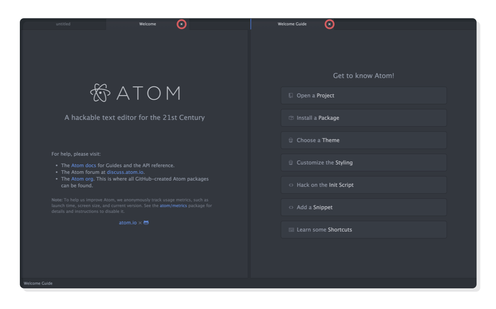
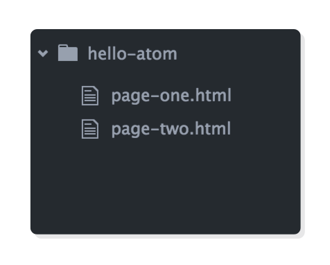
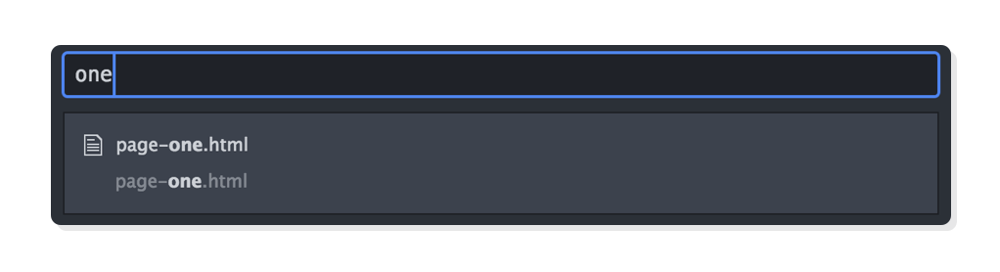
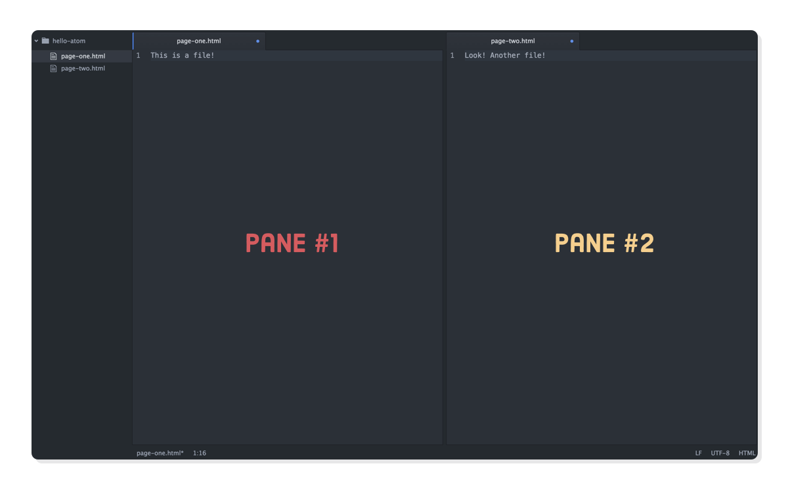

## 简介

HTML CSS JavaScript 是运行在web上的语言，它们关系密切，被设计成用来处理不同的任务，了解它们如何进行互动有助于成为一名Web开发人员。简述如下：

1. HTML用于通过标记来为原始内容添加含义
2. CSS用于美化网页的内容
3. JavaScript用于使内容互动

将HTML视为网页后面的抽象文本和图像，CSS作为实际显示的页面，JavaScript作为可以处理HTML和CSS的行为。


例如，你可以使用此HTML将某些特定的文本标记为段落：

```html
<p id='some-paragraph'>这是一个段落</p>
```

然后，你可以用一些CSS设置该段落的大小和颜色：

```css
p {
  font-size: 20px;
  color: blue;
}
```

如果你想花点时间，当用户使用一些JavaScript点击它时，我们可以重写该段落（我们将为以后的教程保存一些有趣的东西）：

```javascript
var p = document.getElementById('some-paragraph');
p.addEventListener('click', function(event) {
  p.innerHTML = 'You clicked it!';
});
```

如你所见，HTML，CSS和JavaScript是完全不同的语言，但它们都以某种方式相互引用。大多数网站都依赖这三个网站，但每个网站的外观由HTML和CSS决定。这使得本教程成为你的Web开发历程的一个很好的起点。

### 语言与“web开发”

不幸的是，掌握HTML，CSS和JavaScript只是成为专业Web开发人员的先决条件。这里有一堆其他实用技能来运行一个网站：

- 将HTML组织为可重用的模板
- 建立一个web服务器
- 将文件从本地计算机移动到Web服务器
- 代码或者环境出问题时恢复到以前的版本
- 在服务器上指定域名

处理这些复杂性涉及设置各种“环境”来组织文件和处理你的网站的构建/部署。所有这些都与构成网站的实际HTML，CSS和JavaScript代码打交道。本教程完全专注于HTML和CSS的语言，而不是设置这些底层环境。


获得流畅的HTML和CSS是迈向成为真正的Web开发人员的重要的第一步。我们只是不想让你离开这个教程，认为你将能够自己启动一个完整的网站。然而，你将有技能重新创建互联网上的绝大多数网页。

### Web 出版

那么，什么是“学习”HTML和CSS？我们喜欢通过印刷行业的历史镜头来看待它。回到原来的印刷机的时代，打印机通过排列金属字符，将它们浸入墨水并将它们压在一张纸上来创建文档。

在很多方面，这正是Web开发人员做的，除了不是排列可移动类型，他们写HTML和CSS。我们关心的是同样的任务：传达有意义的内容。我们甚至处理他们所做的相同的表示问题，例如选择要使用的字体，设置标题的大小，以及确定文本行之间的间隔。


打印机用于打印一堆页面并将其绑定到一本书中。现在，我们创建了一堆HTML文件，并将它们链接到一个网站。学习HTML和CSS是理解可用的HTML标记和CSS规则的一个问题，使浏览器准确地呈现这些文件是如何应该的。

### 基础，而不是框架

有各种各样的前端Web开发框架（Bootstrap，ZURB foundation和Pure CSS，仅举几例）。其中每一个的目标是从头开始抽象出创建网页的一些冗余方面。这些类型的框架是现实Web开发的重要组成部分，他们绝对值得探索 - 但只有先掌握了基本的HTML＆CSS。

本教程是关于HTML和CSS基础。学完后你能够构建几乎任何你需要作为一个web开发人员与原始的HTML和CSS。这是永远留在你脑海里的东西。

### 动手实践

本教程的整个内容都围绕着具体的例子，解释了HTML和CSS的概念方面。

要充分利用本教程，你应该积极创建网页，并跟随每一章的每一步。如果你认真成为一名网络开发人员，你应该逐个字符地输入每个代码片段，而不是将它们复制并粘贴到你的文本编辑器中。

因为这是你真正的做一个真正的Web开发人员。输入代码示例成为肌肉记忆，一旦你在真正的工作中为真正的网站标记内容，这将为你有好处。

### 工具

对于本教程，一个优秀的文本编辑器和Web浏览器是必要的。你的基本工作流程是在文本编辑器中编写代码，然后在Web浏览器中打开它以查看它的外观。当你开始创建自己的网站，你最终会添加更多的工具到你的工具箱，但重要的是从零开始，彻底学习HTML和CSS的基础。


也就是说，花时间来真正地使用你的文本编辑器。优秀的功能可以让你比正常情况更快地编写代码，比如自动完成标签，跳过文本和浏览文件系统。充分利用你的文本编辑器是学习HTML和CSS的工艺部分。

一个好的网络浏览器的唯一真正的先决条件是它是最新的和主流使用。 Chrome和Firefox是网络开发人员最喜欢的。 Safari是好的，如果你运行的是OS X。我们强烈建议不要使用Internet Explorer创建网站。专业的Web开发通常需要一种有效的方法来测试所有这些浏览器上的代码，但是这比我们现在所需要的要复杂一些。

### Atom 文本编辑器

我们建议使用[Atom](https://atom.io/)文本编辑器。它即使对初学者也是用户友好的，提供了我们上面提到的所有有用的功能，并可用于所有主要操作系统。它也可以自有配置，这将变得重要，因为你可以自动化重复任务。

如果你还没有Atom，现在就下载它，因为下一章将需要它。下载后，打开它，以便我们可以简要地浏览其主要功能。你应该看到两个窗格有不同的欢迎屏幕：



我们不需要任何一个欢迎屏幕，因此通过单击相应选项卡中的x图标关闭它们。你也可以使用Cmd + W（Mac）或Ctrl + W（Windows / Linux）快捷方式来关闭它们（快捷方式非常棒，只要可以使用它们）。你应该留下一个单一的未命名选项卡。

### 创建一个项目

你在Atom中工作的每个网站都是一个“项目”，它本质上只是一个文件系统上的文件夹，包含一堆HTML和CSS文件。让我们通过创建一个假项目并添加一些文本文件来探索Atom。单击菜单栏中的文件>打开以打开文件对话框窗口，然后选择新建文件夹以创建新文件夹。调用它hello-atom，然后单击打开。


你现在应该在界面左侧看到一个侧边栏，在顶部的hello-atom旁边显示一个小文件夹图标。这是我们的文件浏览器。当然，它不会显示任何东西，直到我们添加一些文件，所以让我们做下一步。

### 创建文件

将一些任意文本添加到未命名的选项卡，然后按Cmd + S（Mac）或Ctrl + S（Windows，Linux）保存文件。称为page-one.html。保存后，你应该看到它出现在Atom的文件浏览器中。

让我们通过点击Cmd + N（Mac）或Ctrl + N（Windows，Linux）再做一个文件。这将创建另一个未命名的标签。和我们的最后一个文件一样，添加任何你想要的文本，然后将其保存为page-two.html。

### 浏览文件系统

同样，正确的文本编辑器最重要的方面之一是让你高效地浏览项目中的所有文件。在Atom中，你可以选择要处理的文件的选项卡，或者在界面左侧的文件浏览器中找到它。你还可以使用Ctrl + Tab在打开的选项卡之间切换。



浏览的都是正常文件，但有些时候，当你搜索一个特定的文件。例如，假设你在进行某些质量保证时发现网站上存在损坏的链接。你希望能够使用Atom跳转到该文件，以尽快修复链接。



为此，你需要Atom的模糊查找器，可以通过Cmd + T（Mac）或Ctrl + T（Windows，Linux）访问。当你按下这个，Atom会打开一个搜索栏，让你输入任何部分的文件名你正在寻找。尝试关闭两个选项卡，击中Cmd + T或Ctrl + T，并输入“一个”。 page-one.html文件应该会弹出，你可以按Enter键进行编辑。这个功能是必不可少的一旦你的项目增长到几十个文件分布在几个文件夹。

### 多窗格

Atom不仅允许你拥有多个选项卡，还可以拥有多个窗格。要查看我们正在谈论的内容，请尝试右键单击文件浏览器中的某个文件，然后选择“Split Right”。这将在新窗格中打开该文件，允许你同时查看多个文件。


多个窗格对于同时检查CSS文件及其相关的HTML文件非常有用。

### Atom外部
最后，我们偶尔需要处理Atom界面之外的文件（例如，当我们想将图像文件复制到我们的网站时）。我们可以使用操作系统的内置文件浏览器。右键单击Atom文件浏览器中的文件，然后选择在Finder / Explorer /其他文件浏览器中显示以在系统的默认文件浏览器中打开它。

从这里，你可以在网络浏览器中添加新文件，创建文件夹或打开HTML文件。最后一个将成为本教程其余部分的常见任务，所以让我们使用我们的page-one.html文件进行拍摄。在系统的默认文件浏览器中右键单击它，然后选择打开方式> Chrome / Firefox / Safari。你应该看到添加到在默认Web浏览器中呈现为网页的文件中的任何文本。


现在，你可以在Atom中编辑page-one.html的内容，保存它，然后按Cmd + R（Mac）或Ctrl + R（Windows，Linux）将其重新加载到Web浏览器中。这是基本的编辑工作流程 对于所有的web开发人员，你会变得非常，非常习惯，当你完成了接下来的13章。

### 总结

恭喜！你已经完成了迈向成为专业网络开发人员的第一步。希望，本章给你一个基本的了解适合更广泛的行业的Web开发和HTML和CSS背后的思想。

我们刚刚介绍的Atom东西将成为我们日常生活的一部分，所以在继续之前，确保你对一切都很舒服。我们鼓励你使用示例项目，添加更多的文件和练习从一个到另一个。掌握编写HTML和CSS的工艺是什么让惊人的生产力开发人员与平均。

现在我们有了一个合适的文本编辑器，我们准备开始编码一些真正的网页。我们将从接下来的两章开始探索最常见的HTML元素，然后我们将添加一些CSS到混合。
