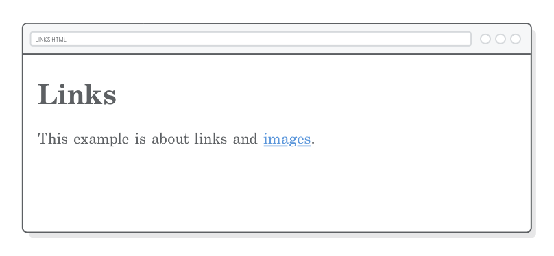
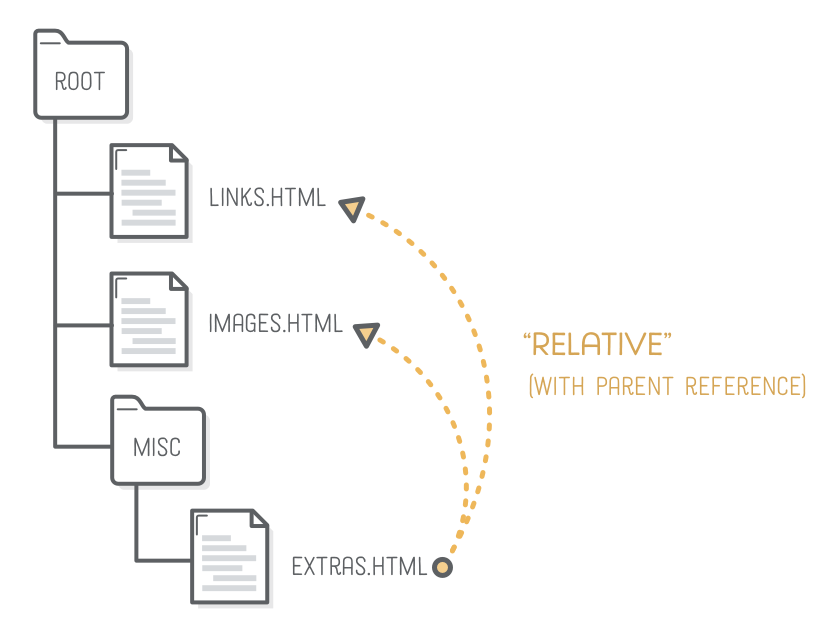

## 链接、图像

上一章讨论了一些非常重要的HTML元素，但我们只处理一个网页。链接和图像与这些元素在根本上不同于它们处理外部资源。链接指向用户不同 HTML文档和图像将另一个资源引入页面。


要使用链接和图片，我们还需要了解HTML语法的另一个组件：attributes。属性将为我们的网页开辟一个全新的可能性世界。

在本章中，我们将创建一个由几个HTML文档和图像文件组成的简单网站。它可能被称为链接和图像，但本章的中心主题实际上是围绕文件和文件夹组织。当我们开始处理多个文件时，我们将发现成为一个有组织的Web开发人员的重要性。

### 设置

本章主要关于将网页链接在一起，因此我们需要在我们编写代码之前创建一些新的HTML文件。我们将在本章中使用三个单独的网页，以及各种格式的几个图像文件


开始请创建一个名为links-and-images的新文件夹以存储我们的所有文件。你应该能够在Atom中使用我们在“简介”一章中所遵循的相同过程。

#### 链接页面

接下来，将一个新文件添加到名为links.html的文件夹，然后插入以下HTML模板。这应该是你熟悉的从前一章。

```html
<!DOCTYPE html>
<html>
  <head>
    <title>Links</title>
  </head>
  <body>
    <h1>Links</h1>
  </body>
</html>
```

#### 图片页面

在同一文件夹中，创建另一个名为images.html的文件：

```html
<!DOCTYPE html>
<html>
  <head>
    <title>Images</title>
  </head>
  <body>
    <h1>Images</h1>
  </body>
</html>
```

#### 附加页

我们的最后一页将帮助我们展示相关的链接。在名为misc的链接和图像中创建一个新文件夹，然后添加一个名为extras.html的新文件

```html
<!DOCTYPE html>
<html>
  <head>
    <title>Extras</title>
  </head>
  <body>
    <h1>Extras</h1>
  </body>
</html>
```

请注意，你可以在Atom中创建一个新文件夹，方法是右键单击文件浏览器窗格，然后在上下文菜单中选择新建文件夹。生活是更好的，当你从来没有需要离开你的文本编辑器。

#### 图像下载

我们将在我们的images.html文件中嵌入图像，所以一定要下载这些示例mochi图像。将其解压缩到你的links-and-images文件夹，从ZIP文件保持父图像文件夹。你的项目现在应该如下所示：


### 锚点

链接使用&lt;a&gt;元素创建，表示“anchor”。它的工作方式与上一章中的所有元素相同：当你在&lt;a&gt;标签中包装某些文本时，它会更改该内容的含义。让我们通过在links.html的&lt;body&gt;元素中添加以下段落来看看：

```html
<p>This example is about links and <a>images</a>.</p>
```

如果你在网络浏览器中加载网页，你会注意到&lt;a&gt;元素根本不像链接。是的，不幸的是，&lt;a&gt;元素本身不做任何事情。

### 链接

以同样的方式，一个元素给它包含的内容添加意义，一个HTML“属性”为它附加的元素添加意义。


不同的元素允许不同的属性，你可以参考MDN了解哪些元素接受哪些属性的详细信息。现在，我们关心的是href属性，因为它决定了用户点击&lt;a&gt;元素时所处的位置。更新你的链接以匹配以下内容：

```html
<p>This example is about links and <a href='images.html'>images</a>.</p>
```

注意属性如何在开始标签内部生效。属性名称先出现，然后是等号，然后属性的“值”以单引号或双引号引出。此语法将属性与内容（位于标记之间）区分开。

href属性提供的额外信息位告诉浏览器这个&lt;a&gt;元素实际上是一个链接，它应该将内容呈现为默认的蓝色文本：



### 绝对，相对和根相对链接

现在我们正在使用链接，我们需要了解网站的结构。为了我们的目的，网站只是组织成文件夹的HTML文件的集合。
为了从另一个文件内部引用这些文件，因特网使用“统一资源定位符”（URL）。根据你所指的是什么，
网址可以采用不同的形式。我们将要处理的三种类型的网址在下面突出显示：


绝对，相对和根相对链接指的是href属性的值。接下来的几节将解释如何和何时使用它们。
但首先，我们将以下内容添加到我们的links.html文件：

```html
<p>This particular page is about links! There are three kinds of links:</p>

<ul>
  <!-- Add <li> elements here -->
</ul>
```

#### 绝对链接

“绝对”链接是你可以引用Web资源的最详细的方式。它们以“scheme”（通常是http：//或https：//）开头，后面是网站的域名，然后是目标网页的路径。


例如，尝试创建指向Mozilla开发人员网络的HTML元素引用的链接：

```html
<li>Absolute links, like to
    <a href='https://developer.mozilla.org/en-US/docs/Web/HTML'>Mozilla
    Developer Network</a>, which is a very good resource for web
    developers.</li>
```

有可能使用绝对链接来引用你自己的网站中的页面，但硬编码你的域名到处可以做一些棘手的情况。通常只是为了将用户定向到不同的网站而保留绝对链接是一个更好的主意。


#### 相对链接

“相对”链接指向你正在编辑的文件的有利位置的网站中的另一个文件。这意味着该方案和域名与当前页面相同，因此你需要提供的唯一的东西是路径。

以下是我们如何从links.html中链接到我们的extras.html文件：

```html
<li>Relative links, like to our <a href='misc/extras.html'>extras page</a>.</li>
```

在这种情况下，href属性表示links.html文件中指向extras.html的文件路径。由于extras.html与links.html不在同一个文件夹中，因此我们需要在网址中包含misc文件夹。


路径中的每个文件夹和文件由正斜杠（/）分隔。所以，如果我们试图找到一个文件夹，两个文件夹深，我们需要一个URL这样：

```
misc/other-folder/extras.html
```

#### 父文件夹

这适用于引用位于同一文件夹或更深层文件夹中的文件。如何链接到当前文件上面的目录中的页面？让我们尝试从extras.html文件中创建指向links.html和images.html的相对链接。将此添加到extras.html：

```html
<p>This page is about miscellaneous HTML things, but you may also be interested in 
    <a href='links.html'>links</a> or <a href='images.html'>images</a>.</p>
```

当你在网络浏览器中单击这些链接时，它会抱怨该页面不存在。检查地址栏，你会发现浏览器正在尝试加载misc / links.html和misc / images.html，它正在查找错误的文件夹！这是因为我们的链接是相对于extras.html的位置，它居住在misc文件夹中。


要解决这个问题，我们需要..语法。文件路径中的两个连续点表示指向父目录：

```html
<p>This page is about miscellaneous HTML things, but you may also be
   interested in <a href='../links.html'>links</a> or <a href='../images.html'>images</a>.</p>
```

这就像说，“我知道extras.html是在misc文件夹中。上传文件夹，然后在其中查找links.html和images.html。



要在多个目录中向上导航，请使用多个..引用，如下所示：

```
../../elsewhere.html
```

相对链接很好，因为它们允许你移动整个文件夹，而不必更新你的&lt;a&gt;元素的所有href，但是当你的所有链接开始一串点时，他们可能会有点混乱。它们最适合用于引用同一文件夹中的资源或网站的独立部分。

例如，HTML＆CSS Is Hard中的所有图像都加载了相对URL（我们将稍后学习如何做图像）。这允许我们重命名我们的任何章节段，而不必更新所有的图像路径。

#### 根相对链接

“根相对”链接与上一部分类似，但它们不是相对于当前页面，而是相对于整个网站的“根”。例如，如果你的网站托管在our-site.com上，则所有根相对URL都将相对于our-site.com。


不幸的是，我们讨论根相对链接有一个警告：整个教程使用本地HTML文件，而不是Web服务器上托管的网站。这意味着我们将无法实验根相对链接。但是，如果我们有一个真正的服务器，我们的主页的链接将如下所示：

```html
<!-- This won't work for our local HTML files -->
<li>Root-relative links, like to the <a href='/'>home page</a> of our website,
    but those aren't useful to us right now.</li>
```

根相对链接和相对链接之间的唯一区别是前者以正斜杠开始。该初始正斜杠表示你网站的根。你可以在初始斜杠之后的路径中添加更多文件夹和文件，就像相对链接一样。无论当前页面位于何处，以下路径都可以正常工作（即使在misc / extras.html中）：

```
/images.html
```

根相对链接是一些最有用的链接类型。它们足够明确，以避免相对链接的潜在混淆，但它们不像绝对链接那样过于明确。你会在你的网站开发事业中看到很多，尤其是在那些很难跟踪相关引用的大型网站。

### 链接目标

属性改变了HTML元素的含义，有时你需要修改元素的多个方面。例如，&lt;a&gt;元素还接受定义在用户单击链接时显示页面的目标属性。默认情况下，大多数浏览器用新的页面替换当前页面。我们可以使用target属性让浏览器在新窗口/标签中打开一个链接。

请尝试更改links.html中的绝对链接，以匹配以下内容。注意第二个属性看起来和第一个属性一样，但是它们通过空格（或换行符）彼此分隔：

```html
<li>Absolute links, like to
    <a href='https://developer.mozilla.org/en-US/docs/Web/HTML'
       target='_blank'>Mozilla Developer Network</a>, which is a very good
       resource for web developers.</li>
```

目标属性有一些预定义的值，它们对Web浏览器有特殊的含义，但最常见的是_blank，它指定了一个新的选项卡或窗口。你可以阅读关于MDN的其余部分。

### 命名约定

你会注意到，我们的文件或文件夹中没有一个在他们的名字中有空格。这是有目的的。网址中的空格需要特殊处理，应尽可能避免。要看看我们在说什么，请尝试在我们的links-and-images项目中创建一个名为spaces的新文件是bad.html。向其中添加一些文本，然后在Google Chrome或Safari中打开它（Firefox会欺骗并保留空格）。

```
links-and-images/spaces%20are%20bad.html
```

在地址栏中，你将看到我们的所有空格都被替换为％20，如上所示。网址中不允许使用空格，这是用于表示它们的特殊编码。而不是一个空格，你应该总是使用连字符，正如我们在整个教程一样。使用所有小写字符来保持一致性也是一个好主意。

请注意，我们的文件/文件夹名称与其所代表的网页的网址之间有直接连接。我们的文件夹和文件的名称确定我们的网页的。。它们对用户可见，这意味着你应该投入尽可能多的努力来命名文件，当你创建它们包含的内容。

这些命名约定适用于你网站中的所有文件，而不仅仅是HTML文件。 CSS文件，JavaScript文件和图像应避免空格，并具有一致的大小写。

------
### 图像

与到目前为止我们遇到的所有HTML元素不同，图像内容定义在呈现它的网页之外。幸运的是，我们已经有一种方法可以从HTML文档中引用外部资源：绝对URL，相对URL和根相对URL。

图像包含在网页中，其中包含&lt;img /&gt;标记及其src属性，它指向要显示的图像文件。注意它是一个空元素，如前一章中的类和&lt;hr /&gt;。 （不要添加到我们的项目，我们将在下一节中讨论具体的例子。）

```html

```

视网膜显示器和移动设备使得图像处理比简单的老的&lt;img /&gt;标签稍微复杂一些。我们将留下这些复杂性为本教程的响应图像章节。还要确保查看语义HTML章节中的&lt;figure&gt;和&lt;figcaption&gt;元素。

现在，让我们关注在互联网上浮动的许多图像格式。

### 图像格式

网络上使用了四种主要的图像格式，它们都是为了做不同的事情而设计的。了解它们的预期目的对于改善网页的质量有很大的帮助。


接下来的几个小节将分别介绍每种图像格式的理想用例。在继续之前，请确保你已将这些mochi图片解压缩到links-and-images项目中。

#### jpg 图像

JPG图像设计用于处理大型调色板，而无需过多增加文件大小。这使得他们伟大的照片和图像有很多的梯度。另一方面，JPG不允许透明像素，如果你看起来真的接近，你可以在下面的图像的白色边缘看到：


将此mochi.jpg图片嵌入我们的images.html页面，并附上以下代码段（这也包括了其他页面的导航）：

```html
<p>This page covers common image formats, but you may also be looking for <a
   href='links.html'>links</a> and <a href='misc/extras.html'>useful
   extras</a>.</p>

<h2>JPGs</h2>

<p>JPG images are good for photos.</p>


```

### gif 图像

GIF是简单动画的首选选项，但缺点是它们在调色板方面有些局限 - 从不使用它们作为照片。透明像素是GIF的二进制选项，意味着你不能有半透明像素。这可能使得难以在透明背景上获得高水平的细节。
因此，如果你不需要动画，通常最好使用PNG图像。


你可以使用以下内容将这个小家伙添加到我们的images.html文件中：

```html
<h2>GIFs</h2>

<p>GIFs are good for animations.</p>


```

### png图像

PNG是伟大的任何东西，不是一个照片或动画。对于照片，相同质量（如感觉到人眼）的PNG文件通常将大于等同的JPG文件。然而，他们处理不透明度很好，他们没有调色板限制。这使它们非常适合图标，技术图表，标志等。


让我们将这个PNG图像添加到我们的示例项目中：

```html
<h2>PNGs</h2>

<p>PNGs are good for diagrams and icons.</p>


```

### svg图像

与上述基于像素的图像格式不同，SVG是一种基于矢量的图形格式，这意味着它可以向上或向下缩放到任何尺寸，而不会损失质量。这个属性使SVG图像成为响应式设计的奇妙工具。它们适用于几乎所有与PNG相同的用例，你应该尽可能使用它们。


这些300×300像素图像原来是100×100像素，但是放大它们清楚地示出它们之间的差异。注意左侧SVG图像上清晰，干净的线条，而右侧的PNG图像现在非常像素化。

尽管是矢量格式，SVG可以像它们的光栅对应一样使用。继续并将mochi.svg添加到我们的images.html页面：

```html
<h2>SVGs</h2>

<p>SVGs are <em>amazing</em>. Use them wherever you can.</p>


```

SVG有一个潜在的问题：为了让它们跨浏览器一致地显示，你需要使用图像编辑器（例如，Abode Illustrator或Sketch）将任何文本字段转换为大纲。如果你的图片包含大量文本（例如本教程中的幻灯片截图），这可能会对文件大小产生很大影响。因此，InternetingIsHard.com使用PNG而不是SVG，即使SVG是如此真棒。

### 图像尺寸

默认情况下，&lt;img /&gt;元素使用其图像文件的继承维度。我们的JPG，GIF和PNG图片实际上是150×150像素，而我们的SVG木马只有75×75像素。


由于我们将在[响应图像]()中进一步讨论，基于像素的图像格式需要是希望它们出现在视网膜显示器上的两倍大。要将我们的基于像素的图片降低到预期大小（75×75），我们可以使用&lt;img /&gt;元素的width属性。在images.html中，更新所有基于像素的图片以匹配以下内容：

```html
<!-- In JPGs section -->


<!-- In GIFs section -->


<!-- In PNGs section -->

```

width属性设置图像的显式维度。还有一个对应的height属性。仅设置其中一个将使图像按比例缩放，而定义两个图像将拉伸图像。维度值以像素为单位指定，且不应包含单位（例如，width ='75px'将不正确）。

width和height属性可能很有用，但通常最好使用CSS设置图片尺寸，以便你可以使用媒体查询进行更改。我们将到[响应式设计]()更详细地讨论这一点。

### 替代文本

向你的&lt;img /&gt;元素添加alt属性是最佳做法。它定义了正在显示的图像的“文本替代”。这对具有纯文本浏览器的搜索引擎和用户（例如，由于视觉障碍而使用文本到语音软件的人）具有影响。

更新我们的所有图片以包含描述性的alt属性：

```html
<!-- In JPGs section -->


<!-- In GIFs section -->


<!-- In PNGs section -->


<!-- In SVGs section -->

```

有关如何使用alt属性的更多示例，请参考详细的[官方规范](https://www.w3.org/TR/html5/embedded-content-0.html#alt)。

### 更多html属性

现在，我们（希望）更加乐于使用HTML属性语法，我们可以为HTML样板代码添加几个整理。你创建的每个网页都应该定义它所写的语言及其字符集。

#### 文档语言

网页的默认语言由顶层<html>元素上的lang属性定义。我们的文档是英文，因此我们将使用en国家/地区代码作为属性值（为我们创建的所有网页执行此操作）：

```html
<html lang='en'>
```

如果你不确定你的语言的国家/地区代码是什么，你可以在[这里](http://www.iana.org/assignments/language-subtag-registry/language-subtag-registry)查看它在子标签字段。

#### 字符集

“字符集”是一种类似于浏览器的数字字母表。它与文档的语言不同，它只影响字母本身的呈现方式，而不影响内容的语言。让我们复制和粘贴一些国际字符到我们的misc / extras.html网页，看看会发生什么。

```html
<h2>Character Sets</h2>

<p>You can use UTF-8 to count in Turkish:</p>

<ol>
  <li>bir</li>
  <li>iki</li>
  <li>üç</li>
  <li>dört</li>
  <li>beş</li>
</ol>
```

当你在浏览器中查看这个，你会看到一些奇怪的东西，ü，ç，ö和ş字符应该是：


这是因为大多数浏览器的默认字符集不支持这些“特殊”字符。要解决这个问题，请通过向misc / extras.html文件的<head>添加带有charset属性的元素<meta>来指定UTF-8字符编码：

```html
<meta charset='UTF-8'/>
```

特殊字符现在应正确呈现。现在，UTF-8类似于互联网的通用字母表。你创建的每个网页都应在其<head>中包含此行。

### html实体

好吧，所以这最后一节实际上没有任何关系到链接或图像，但我们需要讨论一个事情之前切换齿轮到CSS。 “HTML实体”是一个特殊字符，不能在HTML文档中表示为纯文本。这通常意味着它是HTML中的保留字符，或者你的键盘上没有键。

#### 保留字符

<，>和＆字符称为“保留字符”，因为它们不允许在未编码的情况下插入到HTML文档中。这是因为它们意味着HTML语法中的某些东西：<开始一个新标签，>结束标签，并且，当我们要学习，并设置一个HTML实体。

在misc / extras.html中，添加以下内容：

```html
<h2>HTML Entities</h2>
<p>There are three reserved characters in HTML: &lt; &gt; and &amp;. You
   should always use HTML entities for these three characters.</p>
```

实体始终以＆号（＆）开头，以分号（;）结尾。在中间，你放一个特殊的代码，你的浏览器会解释为一个符号。在这种情况下，它将lt，gt和amp分别解释为小于，大于和和符号。

有一个crap吨的HTML实体。我们会让你自己探索他们中的大多数。

#### quotes

卷曲的报价是绝对不必要的，但如果你关心的排版，他们会是一些 你将使用的最常见的HTML实体。有四种不同的卷曲报价（开始和结束单引号和双引号）：

* &ldquo;
* &rdquo;
* &lsquo;
* &rsquo;

你可以使用它们来代替“和”直引号，如下所示：

```html
<p>If you&rsquo;re into &ldquo;web typography,&rdquo; you&rsquo;ll also find
   yourself using curly quotes quite a bit.</p>
```

与直引号不同，这些卷积引用实体应该拥抱文本。

#### utf-8和html实体

在网络的旧时代，HTML文件不允许在其中包含特殊字符，使实体更有用。但是，由于我们现在使用的是UTF-8字符集，因此我们应该能够将任何字符直接插入到HTML文档中。这使得实体主要用作保留字符或为了方便创作直HTML时。

### 总结

网站基本上只是一堆HTML，图像，和（我们​​将很快学到）CSS文件链接在一起。你应该开始想一个网站作为一个美丽的方式，用户导航我们创建的文件夹和文件作为Web开发过程的一部分。从这个角度来看，应该清楚的是，维护一个组织良好的文件系统是创建网站的一个关键方面。

我们还学习了一些重要的属性（lang和charset），它们为我们提供了基本的模板，你应该使用它作为每个网页的开始：

```html
<!DOCTYPE html>
<html lang='en'>
  <head>
    <meta charset='UTF-8'/>
    <title>Some Web Page</title>
  </head>
  <body>
    <h1>Some Web Page</h1>
    <!-- Rest of the page content -->
  </body>
</html>
```

但是，我们仍然缺少一个很大的块：CSS。在下一章中，我们将会发现更多的HTML元素和属性，让我们将CSS样式附加到整个网站。使用多个文件并以智能方式将它们彼此链接的能力将变得比本章中更重要。
